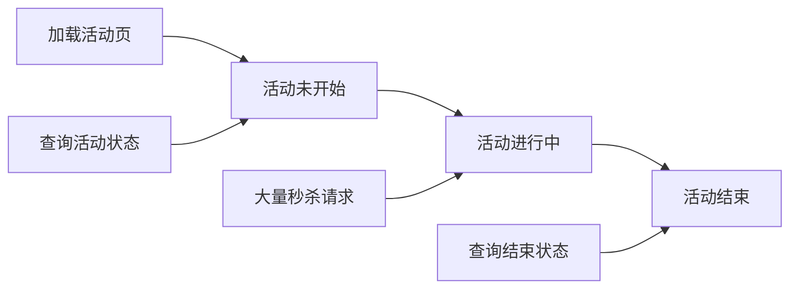
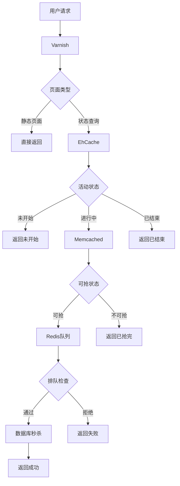

# 高并发系统设计及秒杀实践

## 概述

大型网站应用通常从小规模网站或单机应用发展而来。为了支持足够大的业务量，需要采用各种技术：前端静态资源压缩整合、CDN、分布式SOA架构、缓存、数据库索引、读写分离等。本文将重点介绍高并发业务实现的原则，以及通过6万QPS的秒杀活动实践，分析秒杀业务特点及优化策略。

## 高并发系统设计原则

高并发接口/系统的共同特性是**"快"**。在系统其他条件既定的情况下，处理请求越快，用户反馈时间越短，单位时间内服务器处理请求数量越多。"快"是高并发系统的必要条件，也是系统性能评估的直观标准。

### 核心原则

实现"快"的两个核心原则：

1. **做得少** - 功能有所为有所不为，处理信息量要少
2. **做得巧** - 根据业务特点选择合理的实现方式和缓存策略

## 做得少：减少负担

### 功能特性有选择

对于高并发接口，尽量避免涉及难以缓存和预热的数据，特别是用户维度个性化数据。

#### 问题示例

**案例1：用户秒杀资格信息**
```
用户A: 抢到时间2021-11-11 10:00:01, 优惠50元
用户B: 抢到时间2021-11-11 10:00:05, 优惠40元
...
```
每个用户信息不同，缓存命中率低，压力直接打到数据库。

**案例2：动态优惠价格**
```
用户A参与活动: [满减活动, 新用户活动] → 最低价 ¥199
用户B参与活动: [满减活动] → 最低价 ¥219
```

#### 解决方案

**1. 转移数据维度**
```
// 从用户维度
Key: userId_123 → Value: {time, discount, ...}

// 转为活动维度  
Key: activity_456 → Value: [userId1, userId2, ...]
```

**2. 业务流程后移**
将个性化数据查询移至流量较小的后续环节，如订单创建阶段。

### 处理信息量要少

单次处理的业务对象数量直接影响性能。需要注意：

- 缓存占用空间过大
- 缓存key数量过多  
- 网络传输耗时
- 对象序列化/反序列化耗时

#### 优化案例：影院场次展示

```
优化前: 一次返回影院全部场次 (500-1000场)
↓ memcached multi get 超时频繁
↓ 请求打到MySQL

优化后: 按维度分批获取
- 按影片分批: 10-20场/次
- 按日期分批: 15-30场/次  
- 按影院分批: 20-40场/次
```

## 做得巧：选择最佳方案

### 根据业务特性选择实现方式

根据业务的实时性要求、数据一致性要求、涉及维度和数据量大小选择合适方案。

#### 示例：商品最低价统计

```
实时计算方案:
遍历所有商品 → 缓存/数据库查询 → 计算最低价
↓ 耗时长，高并发下压力大

离线计算方案:  
定时作业计算 → 结果入库 → 缓存 → 直接读取
↓ 响应快，并发能力强
```

### 合理选择和调用缓存

#### 缓存性能层次

```
内存 < ehcache < redis ≤ memcached < mysql
```

#### 常用缓存特性对比

| 缓存类型 | 特点 | 适用场景 | 优缺点 |
|---------|------|----------|--------|
| **Varnish** | 反向代理缓存 | 静态页面、资源文件 | ✅ 直接挡掉web服务器请求<br>❌ 只适用于静态内容 |
| **EhCache** | 本地内存缓存 | 不常变化的少量数据 | ✅ 存取极快<br>❌ 内存有限，数据不一致风险 |
| **Memcached** | 分布式KV缓存 | 大量缓存对象，高并发访问 | ✅ 扩展性好，承接高流量<br>❌ 网络延迟0.几ms到几ms |
| **Redis** | 内存数据结构存储 | 复杂数据结构，分布式锁 | ✅ 丰富数据结构，服务器端计算<br>❌ 相对复杂 |

## 秒杀实践

### 秒杀业务特点

1. **瞬时流量大** - 短时间内大量并发请求
2. **参与用户多，商品少** - 典型的供需失衡
3. **请求读多写少** - 大量状态查询，少量成功购买
4. **实时性要求高** - 状态变化需立即反馈

### 秒杀流程三阶段



#### 各阶段请求分析

**阶段1：活动未开始**
- 加载活动页信息 (50%)
- 查询活动状态 (50%)

**阶段2：活动进行中** 
- 瞬时秒杀请求暴增
- 系统承压关键时期

**阶段3：活动结束**
- 请求模式回归阶段1


### 核心优化策略

#### 1. 加载活动页优化

**使用Varnish反向代理缓存**

```
缓存Key: hash(activityId + cityId)  
缓存内容: 完整HTML页面
动态内容: 通过Ajax异步加载
```


**效果**: 页面加载请求完全由Varnish处理，不给Web服务器带来任何压力。

#### 2. 活动状态查询优化

秒杀状态由三个因素决定：
1. **活动开始时间** (相对固定)
2. **剩余库存** (快速变化)  
3. **排队人数** (动态控制)

**缓存策略**:

```
活动时间: EhCache (本地缓存，快速响应)
库存状态: Memcached (全局一致性)
排队控制: Redis (精确计数控制)
```

**关键优化**: 缓存boolean值而非具体库存数

```java
// 优化前: 频繁更新具体库存数
cache.set("stock_count", currentStock);  // 每次秒杀都要更新

// 优化后: 缓存是否可抢状态
cache.set("can_buy", true);  // 只在库存耗尽时更新一次
```

#### 3. 秒杀请求核心优化

**问题分析**:
- 秒杀是写请求，无法缓存
- 数据库操作耗时长
- InnoDB行锁导致排队等待

**解决方案: 秒杀队列校验**

```
判断可抢状态 = 有库存 AND 排队人数 < 限制数

示例:
2500个秒杀名额 → 限制3000个请求参与
```

**实现方式**:

```java
// 方式1: 简单计数 (Memcached)
if(memcached.incr("queue_count") <= LIMIT) {
    // 继续秒杀流程
} else {
    // 直接返回失败
}

// 方式2: 去重控制 (Redis Set)
if(redis.sadd("user_queue", userId)) {
    // 用户首次进入，继续流程
} else {
    // 重复用户，直接拒绝
}
```

#### 4. 高级优化策略

**分库存优化**

```
总库存: 50000个
分片策略: 50个分片，每片1000个
用户随机路由到不同分片

优势: 降低单点竞争，提升并发处理能力
劣势: 低流量时用户体验不佳
```

**异步消息优化**

```
同步流程: 扣库存 → 发货 → 返回结果
异步流程: 扣库存 → 立即返回 → 异步发货 → 短信/Push通知
```

### 秒杀系统整体架构



### 性能效果

通过多层缓存和队列控制：

1. **Varnish** - 挡掉所有静态页面请求
2. **EhCache** - 挡掉活动未开始的状态查询  
3. **Memcached** - 挡掉活动期间的状态查询
4. **Redis队列** - 控制过量秒杀请求
5. **最终结果** - 只有秒杀商品数量级的请求到达数据库

**实际效果**: 从几万并发请求降低到商品数量级的数据库操作，系统稳定承载6万QPS。

## 总结

高并发系统设计的核心是在架构层面做减法和优化：

1. **减少功能复杂度** - 避免个性化数据，控制处理信息量
2. **选择合适方案** - 根据业务特性选择最佳实现方式  
3. **分层缓存设计** - 不同层次缓存处理不同类型请求
4. **流量控制策略** - 通过队列机制控制核心资源访问

通过这些策略的综合运用，可以构建出能够承载超高并发的稳定系统。


[开源项目](https://gitee.com/52itstyle/spring-boot-seckill)