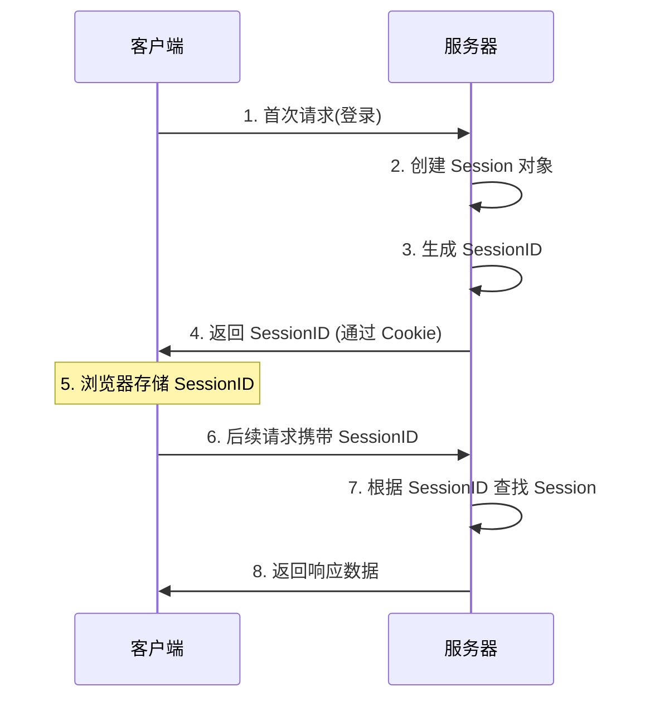
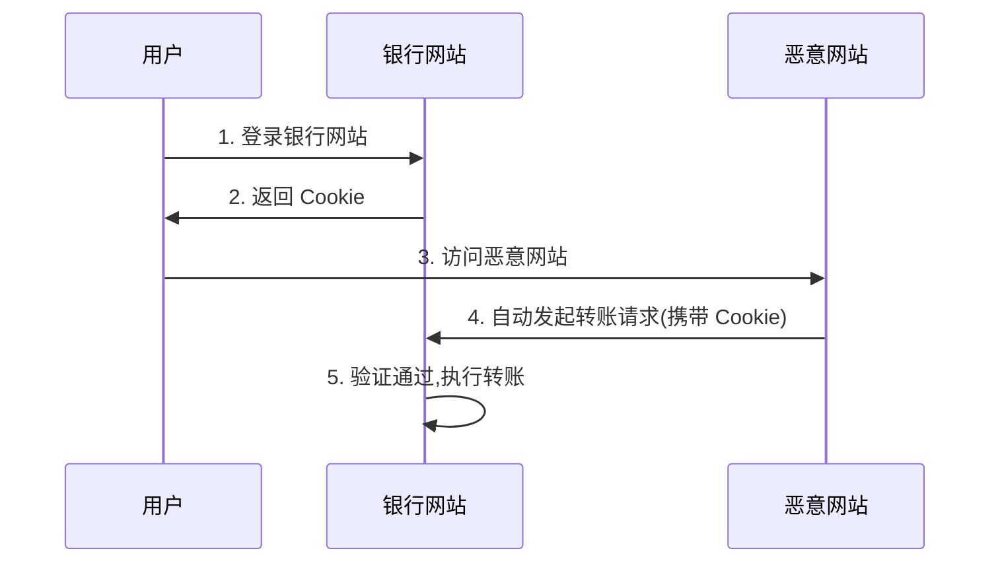

# Java Web 面试题精讲

## 一、JSP 与 Servlet

### 1.1 JSP 和 Servlet 有什么区别?

**核心区别:**

| 对比维度 | Servlet | JSP |
|---------|---------|-----|
| **本质** | Java 类,需要编译 | Servlet 的扩展,本质上是简化的 Servlet |
| **代码组织** | Java 代码与 HTML 完全分离 | Java 代码与 HTML 可混合编写 |
| **侧重点** | 控制逻辑(Controller) | 视图展示(View) |
| **开发效率** | 修改 HTML 需要重新编译 | 修改页面更灵活便捷 |

**总结:** JSP 更适合编写动态页面,Servlet 更适合处理业务逻辑。在 MVC 架构中,Servlet 充当 Controller,JSP 充当 View。

---

### 1.2 JSP 的 9 大内置对象

| 内置对象 | 类型 | 作用域 | 说明 |
|---------|------|--------|------|
| **request** | HttpServletRequest | Request | 封装客户端请求信息,包含 GET/POST 参数 |
| **response** | HttpServletResponse | Page | 封装服务器响应信息 |
| **session** | HttpSession | Session | 封装用户会话数据 |
| **application** | ServletContext | Application | 封装服务器运行环境,全局共享 |
| **pageContext** | PageContext | Page | 页面上下文,可获取其他 8 个对象 |
| **out** | JspWriter | Page | 输出流对象,向页面输出内容 |
| **config** | ServletConfig | Page | Servlet 配置对象 |
| **page** | Object | Page | 当前页面对象(类似 Java 中的 this) |
| **exception** | Throwable | Page | 异常对象,仅在错误页面可用 |

**注意:** 使用 exception 对象需要在 page 指令中设置 `isErrorPage="true"`。

---

### 1.3 JSP 的 4 种作用域

作用域决定了数据的生命周期和可访问范围:

#### 1. **page** 作用域
- **生命周期:** 仅在当前页面有效
- **使用场景:** 页面内部临时变量
- **实现方式:** `pageContext.setAttribute()`

#### 2. **request** 作用域
- **生命周期:** 一次请求内有效(可跨页面转发)
- **使用场景:** 请求转发时传递数据
- **实现方式:** `request.setAttribute()`

#### 3. **session** 作用域
- **生命周期:** 一次会话内有效(浏览器不关闭)
- **使用场景:** 用户登录信息、购物车数据
- **实现方式:** `session.setAttribute()`

#### 4. **application** 作用域
- **生命周期:** 应用程序运行期间
- **使用场景:** 全局配置、访问统计
- **实现方式:** `application.setAttribute()`

**作用域范围:** page < request < session < application

---

## 二、Session 与 Cookie

### 2.1 Session 和 Cookie 的区别

| 对比维度 | Session | Cookie |
|---------|---------|--------|
| **存储位置** | 服务器端 | 客户端浏览器 |
| **安全性** | 较高,数据存储在服务器 | 较低,可被窃取、伪造、篡改 |
| **存储容量** | 无限制(受服务器内存限制) | 单个 Cookie ≤ 4KB,每个站点约 20-50 个 |
| **生命周期** | 可配置超时时间,关闭浏览器可能失效 | 可设置过期时间,支持持久化 |
| **存储类型** | 可存储任意 Java 对象 | 只能存储字符串 |
| **跨域性** | 不支持跨域 | 可通过设置 domain 实现有限跨域 |
| **性能影响** | 占用服务器内存 | 每次请求都会携带,增加网络流量 |

---

### 2.2 Session 的工作原理



**关键流程:**

1. 用户首次访问时,服务器创建 Session 对象
2. 服务器生成唯一的 SessionID
3. 通过 Cookie 将 SessionID 发送给客户端
4. 客户端后续请求自动携带 SessionID
5. 服务器根据 SessionID 检索对应的 Session 对象

---

### 2.3 禁用 Cookie 后 Session 的解决方案

#### 方案一: URL 重写
```java
// 在 URL 中附加 SessionID
response.encodeURL("user.jsp?jsessionid=xxx");
```

#### 方案二: 隐藏表单字段
```html
<form method="post">
    <input type="hidden" name="jsessionid" value="xxx">
</form>
```

#### 方案三: 使用 Token 机制
- 服务器生成 Token 存储在 Redis 中
- 客户端每次请求在 Header 或参数中携带 Token

---

## 三、框架对比

### 3.1 Spring MVC vs Struts2

| 对比维度 | Spring MVC | Struts2 |
|---------|-----------|---------|
| **拦截级别** | 方法级别(更细粒度) | 类级别 |
| **性能** | 更高,线程安全 | 较低,使用值栈 |
| **数据独立性** | 方法间独立,通过参数传递 | Action 变量共享,容易混淆 |
| **Ajax 支持** | 原生支持,@ResponseBody 即可 | 需要插件或手动实现 |
| **拦截机制** | 基于 AOP,配置简洁 | 自有 Interceptor,配置繁琐 |
| **RESTful** | 原生支持,@PathVariable 等 | 需要插件支持 |
| **学习曲线** | 较平缓 | 较陡峭 |

**推荐:** 新项目建议使用 Spring MVC / Spring Boot。

---

## 四、Web 安全

### 4.1 SQL 注入防御

#### 什么是 SQL 注入?
攻击者通过在输入中插入恶意 SQL 代码,绕过应用程序的安全验证。

**示例:**
```java
// 不安全的拼接方式
String sql = "SELECT * FROM users WHERE username='" + username + "'";
// 如果 username 为: admin' OR '1'='1
// 实际执行: SELECT * FROM users WHERE username='admin' OR '1'='1'
```

#### 防御措施

**1. 使用预编译语句 (推荐)**
```java
String sql = "SELECT * FROM users WHERE username=? AND password=?";
PreparedStatement pstmt = conn.prepareStatement(sql);
pstmt.setString(1, username);
pstmt.setString(2, password);
```

**2. 输入验证**
```java
// 使用正则过滤特殊字符
username = username.replaceAll("[^a-zA-Z0-9]", "");
```

**3. 使用 ORM 框架**
- MyBatis 的 `#{}` 参数化查询
- Hibernate 的参数绑定

---

### 4.2 XSS 攻击防御

#### 什么是 XSS (跨站脚本攻击)?
攻击者在网页中注入恶意脚本代码,当其他用户浏览该页面时,恶意代码被执行。

**攻击示例:**
```html
<!-- 用户输入: <script>alert(document.cookie)</script> -->
<!-- 如果未过滤,会执行脚本窃取 Cookie -->
```

#### 防御措施

**1. 输入过滤 (后端)**
```java
// 过滤 HTML 标签
import org.apache.commons.text.StringEscapeUtils;
String safe = StringEscapeUtils.escapeHtml4(userInput);
```

**2. 输出编码 (前端)**
```jsp
<%-- 使用 JSTL 自动转义 --%>
<c:out value="${userInput}" escapeXml="true"/>
```

**3. 设置 HTTP 响应头**
```java
response.setHeader("X-XSS-Protection", "1; mode=block");
response.setHeader("Content-Security-Policy", "default-src 'self'");
```

**4. 使用现代框架**
- React / Vue 默认会转义内容
- Thymeleaf 的 `th:text` 自动转义

---

### 4.3 CSRF 攻击防御

#### 什么是 CSRF (跨站请求伪造)?
攻击者诱导用户访问恶意网站,利用用户的登录状态,以用户名义发起恶意请求。

**攻击流程:**


#### 防御措施

**1. 验证 Referer / Origin**
```java
String referer = request.getHeader("Referer");
if (referer == null || !referer.startsWith("https://trusted.com")) {
    return "非法请求";
}
```

**2. 使用 CSRF Token (推荐)**
```java
// 生成 Token
String token = UUID.randomUUID().toString();
session.setAttribute("csrfToken", token);

// 验证 Token
String sessionToken = (String) session.getAttribute("csrfToken");
String requestToken = request.getParameter("csrfToken");
if (!sessionToken.equals(requestToken)) {
    return "CSRF 验证失败";
}
```

**3. 关键操作二次验证**
- 支付操作要求输入密码
- 重要操作发送短信验证码

**4. 设置 Cookie 的 SameSite 属性**
```java
Cookie cookie = new Cookie("sessionId", sessionId);
cookie.setSecure(true);
cookie.setHttpOnly(true);
cookie.setAttribute("SameSite", "Strict"); // Servlet 5.0+
```

**5. 使用 Spring Security**
```java
// Spring Security 默认启用 CSRF 防护
http.csrf().csrfTokenRepository(CookieCsrfTokenRepository.withHttpOnlyFalse());
```

---

## 五、面试高频追问

### Q1: Session 集群如何共享?
- **Redis 集中存储:** 将 Session 存储到 Redis
- **Session 复制:** Tomcat 集群间复制 (性能较差)
- **Token 机制:** 使用 JWT 替代 Session

### Q2: Cookie 和 LocalStorage 的区别?
- Cookie 会自动发送到服务器,LocalStorage 不会
- Cookie 容量 ≤ 4KB,LocalStorage ≥ 5MB
- Cookie 可设置过期时间,LocalStorage 永久存储

### Q3: 如何实现单点登录 (SSO)?
- CAS 中央认证服务
- OAuth 2.0 授权
- JWT Token 方案

### Q4: HTTPS 如何防止中间人攻击?
- 使用 SSL/TLS 证书加密传输
- 验证服务器证书的有效性
- 使用 HSTS 强制 HTTPS

---

## 六、学习建议

1. **掌握基础原理:** 深入理解 HTTP 协议、Servlet 规范
2. **实践项目:** 手写简单的 MVC 框架理解原理
3. **关注安全:** OWASP Top 10 必读
4. **现代技术栈:** Spring Boot + Spring Security + JWT
5. **性能优化:** Session 共享、缓存策略、连接池配置

---

**最后更新:** 2025-11-23  
**适用版本:** Java 8+, Servlet 3.1+, Spring 5+