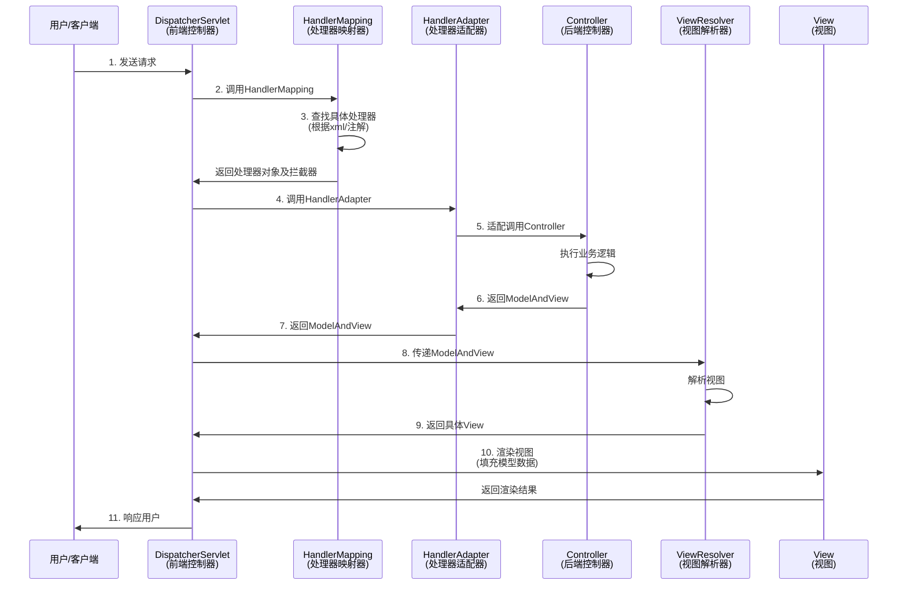

# Spring MVC 面试题

## 基础概念

**1. 什么是 Spring MVC？**

Spring MVC 是 Spring 框架的一个模块，基于 MVC 设计模式的 Web 框架，无需中间整合层即可与 Spring 无缝集成。

**2. Spring MVC 的主要优点**

- 基于组件技术，所有应用对象都是 Java 组件，与 Spring 基础结构紧密集成
- 不依赖于 Servlet API（设计目标，实现时仍依赖 Servlet）
- 支持多种视图技术，不局限于 JSP
- 支持多种请求资源映射策略
- 易于扩展

## 核心流程

**3. Spring MVC 工作原理**



## 数据传递与视图

**Controller 方法的返回值类型**

可以是 String、ModelAndView 等类型，一般推荐使用 String。

**重定向和转发**

- 转发：返回值前加 `forward:`，如 `"forward:user.do?name=method4"`
- 重定向：返回值前加 `redirect:`，如 `"redirect:http://www.baidu.com"`

**后台向前台传递数据**

通过 ModelMap 对象，使用 put 方法添加数据，前台通过 EL 表达式获取。

**视图和数据合并**

使用 ModelAndView 类，可以同时包含视图和数据。

**将数据放入 Session**

在类上添加 `@SessionAttributes` 注解，指定要放入 Session 的 key。

## 拦截器

**拦截器的实现方式**

两种方式：
- 实现 HandlerInterceptor 接口
- 继承 HandlerInterceptorAdapter 适配器类

配置示例：
```xml
<mvc:interceptors>
    <!-- 拦截所有请求 -->
    <bean id="myInterceptor" class="com.et.action.MyHandlerInterceptor"/>
    
    <!-- 拦截特定请求 -->
    <mvc:interceptor>
        <mvc:mapping path="/modelMap.do"/>
        <bean class="com.et.action.MyHandlerInterceptorAdapter"/>
    </mvc:interceptor>
</mvc:interceptors>
```