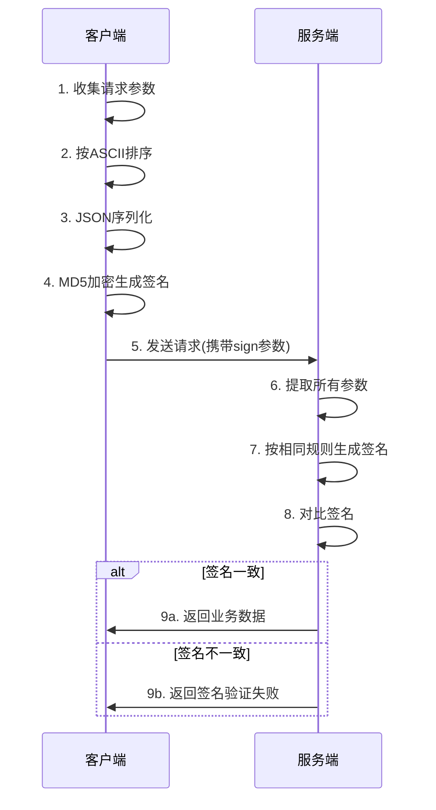

# SpringBoot API接口签名实现指南

## 概述

在现代Web应用开发中，API接口安全是至关重要的。本文将详细介绍如何在SpringBoot2中实现API接口签名机制，有效防止参数篡改，保障接口安全。

**适用场景**：
- 开放API接口
- 无需登录的公共接口
- 对安全要求较高的业务接口
- 第三方系统集成接口

## 核心原理

### 签名验证流程



### 安全机制

- **参数完整性**：任何参数的修改都会导致签名不匹配
- **防重放攻击**：可结合时间戳和随机数增强安全性
- **无密钥传输**：签名在客户端生成，密钥不在网络传输

## 技术架构

### 技术栈选择

| 组件 | 技术 | 版本 | 用途 |
|------|------|------|------|
| 后端框架 | SpringBoot | 2.x | 主框架 |
| JSON处理 | FastJSON | 1.2.47+ | JSON序列化 |
| 加密算法 | MD5 | - | 签名生成 |
| 工具类 | Lombok | - | 代码简化 |
| 前端MD5 | js-md5 | 0.7.3+ | 客户端签名 |

### 系统架构图

```
┌─────────────────┐    HTTP请求     ┌─────────────────┐
│   前端应用      │ ──────────────→ │   SpringBoot    │
│                 │                 │     应用        │
│ ┌─────────────┐ │                 │ ┌─────────────┐ │
│ │ 签名生成器  │ │                 │ │ 签名过滤器  │ │
│ └─────────────┘ │                 │ └─────────────┘ │
│ ┌─────────────┐ │                 │ ┌─────────────┐ │
│ │ HTTP客户端  │ │                 │ │ 业务控制器  │ │
│ └─────────────┘ │                 │ └─────────────┘ │
└─────────────────┘                 └─────────────────┘
```

## 前端实现

### 签名工具类

```javascript
import md5 from 'js-md5'

/**
 * API签名工具类
 */
export default class SignatureUtils {
  
  /**
   * 生成接口签名
   * @param {string} url - 接口路径
   * @param {object} params - 请求参数
   * @returns {string} 签名值
   */
  static generateSign(url, params = {}) {
    // 1. 解析URL参数
    const urlParams = this.parseUrlParams(url)
    
    // 2. 合并所有参数
    const allParams = { ...urlParams, ...params }
    
    // 3. 移除空值参数
    const filteredParams = this.filterEmptyParams(allParams)
    
    // 4. ASCII排序
    const sortedParams = this.sortByAscii(filteredParams)
    
    // 5. JSON序列化并MD5加密
    const jsonString = JSON.stringify(sortedParams)
    return md5(jsonString).toUpperCase()
  }
  
  /**
   * 按ASCII码升序排序对象
   */
  static sortByAscii(obj) {
    return Object.keys(obj)
      .sort()
      .reduce((result, key) => {
        result[key] = obj[key]
        return result
      }, {})
  }
  
  /**
   * 过滤空值参数
   */
  static filterEmptyParams(params) {
    const filtered = {}
    Object.keys(params).forEach(key => {
      const value = params[key]
      if (value !== null && value !== undefined && value !== '') {
        filtered[key] = value
      }
    })
    return filtered
  }
  
  /**
   * 解析URL参数
   */
  static parseUrlParams(url) {
    const params = {}
    const queryIndex = url.indexOf('?')
    
    if (queryIndex === -1) return params
    
    const queryString = url.substring(queryIndex + 1)
    queryString.split('&').forEach(param => {
      const [key, value] = param.split('=')
      if (key && value) {
        params[decodeURIComponent(key)] = decodeURIComponent(value)
      }
    })
    
    return params
  }
  
  /**
   * 对象转URL查询字符串
   */
  static toQueryString(params) {
    return Object.keys(params)
      .map(key => `${encodeURIComponent(key)}=${encodeURIComponent(params[key])}`)
      .join('&')
  }
}
```

### HTTP请求封装

```javascript
import axios from 'axios'
import SignatureUtils from './SignatureUtils'

class ApiClient {
  constructor(baseURL = '') {
    this.instance = axios.create({
      baseURL,
      timeout: 10000,
      headers: {
        'Content-Type': 'application/json'
      }
    })
    
    // 请求拦截器 - 自动添加签名
    this.instance.interceptors.request.use(
      config => this.addSignature(config),
      error => Promise.reject(error)
    )
    
    // 响应拦截器 - 统一错误处理
    this.instance.interceptors.response.use(
      response => response.data,
      error => {
        if (error.response?.status === 401) {
          console.error('签名验证失败')
        }
        return Promise.reject(error)
      }
    )
  }
  
  /**
   * 为请求添加签名
   */
  addSignature(config) {
    const { url, method, params = {}, data = {} } = config
    
    // 根据请求方法确定参数
    let requestParams = method.toLowerCase() === 'get' ? params : data
    
    // 生成签名
    const sign = SignatureUtils.generateSign(url, requestParams)
    
    // 添加签名到URL参数
    const separator = url.includes('?') ? '&' : '?'
    config.url = `${url}${separator}sign=${sign}`
    
    // GET请求需要将参数添加到URL
    if (method.toLowerCase() === 'get' && Object.keys(params).length > 0) {
      const queryString = SignatureUtils.toQueryString(params)
      config.url += `&${queryString}`
      delete config.params
    }
    
    return config
  }
  
  // API方法
  get(url, params = {}) {
    return this.instance.get(url, { params })
  }
  
  post(url, data = {}) {
    return this.instance.post(url, data)
  }
  
  put(url, data = {}) {
    return this.instance.put(url, data)
  }
  
  delete(url, params = {}) {
    return this.instance.delete(url, { params })
  }
}

// 创建API客户端实例
export default new ApiClient('http://localhost:8080')
```

### 使用示例

```javascript
import apiClient from '@/utils/ApiClient'

// GET请求示例
const getUserInfo = async (userId) => {
  try {
    const result = await apiClient.get('/user/info', { userId })
    return result
  } catch (error) {
    console.error('获取用户信息失败:', error)
  }
}

// POST请求示例
const createUser = async (userData) => {
  try {
    const result = await apiClient.post('/user/create', userData)
    return result
  } catch (error) {
    console.error('创建用户失败:', error)
  }
}
```

## 后端实现

### 核心过滤器

```java
import com.alibaba.fastjson.JSONObject;
import lombok.extern.slf4j.Slf4j;
import org.springframework.core.annotation.Order;
import org.springframework.stereotype.Component;
import org.springframework.util.StringUtils;

import javax.servlet.*;
import javax.servlet.http.HttpServletRequest;
import javax.servlet.http.HttpServletResponse;
import java.io.IOException;
import java.io.PrintWriter;
import java.util.Arrays;
import java.util.List;
import java.util.SortedMap;

/**
 * API签名验证过滤器
 */
@Slf4j
@Component
@Order(1)
public class SignatureAuthFilter implements Filter {
    
    /**
     * 不需要签名验证的路径
     */
    private static final List<String> EXCLUDE_PATHS = Arrays.asList(
            "/favicon.ico",
            "/actuator/",
            "/swagger-",
            "/v2/api-docs",
            "/error"
    );
    
    @Override
    public void doFilter(ServletRequest request, ServletResponse response, 
                        FilterChain chain) throws IOException, ServletException {
        
        HttpServletRequest httpRequest = (HttpServletRequest) request;
        HttpServletResponse httpResponse = (HttpServletResponse) response;
        
        // 检查是否需要签名验证
        if (shouldSkipSignatureCheck(httpRequest)) {
            chain.doFilter(request, response);
            return;
        }
        
        try {
            // 包装请求以支持Body重复读取
            BodyReaderHttpServletRequestWrapper wrappedRequest = 
                new BodyReaderHttpServletRequestWrapper(httpRequest);
            
            // 提取并验证签名
            if (validateSignature(wrappedRequest)) {
                log.info("签名验证通过: {}", httpRequest.getRequestURI());
                chain.doFilter(wrappedRequest, response);
            } else {
                handleSignatureError(httpResponse);
            }
            
        } catch (Exception e) {
            log.error("签名验证异常", e);
            handleSignatureError(httpResponse);
        }
    }
    
    /**
     * 判断是否跳过签名检查
     */
    private boolean shouldSkipSignatureCheck(HttpServletRequest request) {
        String requestURI = request.getRequestURI();
        return EXCLUDE_PATHS.stream().anyMatch(requestURI::startsWith);
    }
    
    /**
     * 验证签名
     */
    private boolean validateSignature(HttpServletRequest request) throws IOException {
        // 获取所有参数
        SortedMap<String, String> allParams = HttpParameterUtils.getAllParams(request);
        
        // 提取URL中的签名
        String urlSign = allParams.get("sign");
        if (!StringUtils.hasText(urlSign)) {
            log.warn("请求缺少签名参数: {}", request.getRequestURI());
            return false;
        }
        
        // 移除sign参数后计算签名
        allParams.remove("sign");
        String calculatedSign = SignatureUtils.calculateSignature(allParams);
        
        boolean isValid = urlSign.equals(calculatedSign);
        if (!isValid) {
            log.warn("签名验证失败 - URL: {}, 期望: {}, 实际: {}", 
                    request.getRequestURI(), urlSign, calculatedSign);
        }
        
        return isValid;
    }
    
    /**
     * 处理签名错误
     */
    private void handleSignatureError(HttpServletResponse response) throws IOException {
        response.setStatus(HttpServletResponse.SC_UNAUTHORIZED);
        response.setContentType("application/json;charset=UTF-8");
        
        JSONObject errorResponse = new JSONObject();
        errorResponse.put("success", false);
        errorResponse.put("code", "SIGNATURE_ERROR");
        errorResponse.put("message", "签名验证失败");
        errorResponse.put("timestamp", System.currentTimeMillis());
        
        PrintWriter writer = response.getWriter();
        writer.write(errorResponse.toJSONString());
        writer.flush();
    }
}
```

### 请求参数提取工具

```java
import com.alibaba.fastjson.JSON;
import com.alibaba.fastjson.JSONObject;
import lombok.extern.slf4j.Slf4j;
import org.springframework.http.HttpMethod;
import org.springframework.util.StreamUtils;
import org.springframework.util.StringUtils;

import javax.servlet.http.HttpServletRequest;
import java.io.IOException;
import java.nio.charset.StandardCharsets;
import java.util.*;

/**
 * HTTP参数提取工具类
 */
@Slf4j
public class HttpParameterUtils {
    
    /**
     * 获取请求的所有参数
     */
    public static SortedMap<String, String> getAllParams(HttpServletRequest request) 
            throws IOException {
        
        SortedMap<String, String> params = new TreeMap<>();
        
        // 1. 获取URL参数
        params.putAll(getUrlParameters(request));
        
        // 2. 获取Body参数（非GET请求）
        if (!HttpMethod.GET.name().equals(request.getMethod())) {
            params.putAll(getBodyParameters(request));
        }
        
        // 3. 过滤空值参数
        return filterEmptyValues(params);
    }
    
    /**
     * 获取URL参数
     */
    private static Map<String, String> getUrlParameters(HttpServletRequest request) {
        Map<String, String> params = new HashMap<>();
        
        String queryString = request.getQueryString();
        if (StringUtils.hasText(queryString)) {
            String[] pairs = queryString.split("&");
            for (String pair : pairs) {
                String[] keyValue = pair.split("=", 2);
                if (keyValue.length == 2) {
                    params.put(keyValue[0], keyValue[1]);
                }
            }
        }
        
        return params;
    }
    
    /**
     * 获取Body参数
     */
    private static Map<String, String> getBodyParameters(HttpServletRequest request) 
            throws IOException {
        
        Map<String, String> params = new HashMap<>();
        String contentType = request.getContentType();
        
        if (contentType == null) {
            return params;
        }
        
        if (contentType.contains("application/json")) {
            // JSON格式
            params.putAll(parseJsonBody(request));
        } else if (contentType.contains("application/x-www-form-urlencoded")) {
            // 表单格式
            params.putAll(parseFormBody(request));
        }
        
        return params;
    }
    
    /**
     * 解析JSON Body
     */
    private static Map<String, String> parseJsonBody(HttpServletRequest request) 
            throws IOException {
        
        String body = StreamUtils.copyToString(
            request.getInputStream(), StandardCharsets.UTF_8);
            
        if (!StringUtils.hasText(body)) {
            return new HashMap<>();
        }
        
        try {
            JSONObject jsonObject = JSON.parseObject(body);
            return flattenJsonObject(jsonObject);
        } catch (Exception e) {
            log.warn("解析JSON Body失败: {}", e.getMessage());
            return new HashMap<>();
        }
    }
    
    /**
     * 扁平化JSON对象
     */
    private static Map<String, String> flattenJsonObject(JSONObject jsonObject) {
        Map<String, String> params = new HashMap<>();
        
        for (String key : jsonObject.keySet()) {
            Object value = jsonObject.get(key);
            if (value != null) {
                if (value instanceof String || value instanceof Number || 
                    value instanceof Boolean) {
                    params.put(key, value.toString());
                } else {
                    // 复杂对象转JSON字符串
                    params.put(key, JSON.toJSONString(value));
                }
            }
        }
        
        return params;
    }
    
    /**
     * 解析表单Body
     */
    private static Map<String, String> parseFormBody(HttpServletRequest request) 
            throws IOException {
        
        String body = StreamUtils.copyToString(
            request.getInputStream(), StandardCharsets.UTF_8);
            
        Map<String, String> params = new HashMap<>();
        if (StringUtils.hasText(body)) {
            String[] pairs = body.split("&");
            for (String pair : pairs) {
                String[] keyValue = pair.split("=", 2);
                if (keyValue.length == 2) {
                    params.put(keyValue[0], keyValue[1]);
                }
            }
        }
        
        return params;
    }
    
    /**
     * 过滤空值参数
     */
    private static SortedMap<String, String> filterEmptyValues(Map<String, String> params) {
        SortedMap<String, String> filtered = new TreeMap<>();
        
        params.forEach((key, value) -> {
            if (StringUtils.hasText(value)) {
                filtered.put(key, value);
            }
        });
        
        return filtered;
    }
}
```

### 签名计算工具

```java
import com.alibaba.fastjson.JSON;
import lombok.extern.slf4j.Slf4j;
import org.springframework.util.DigestUtils;

import java.util.Map;

/**
 * 签名工具类
 */
@Slf4j
public class SignatureUtils {
    
    /**
     * 计算参数签名
     */
    public static String calculateSignature(Map<String, String> params) {
        // 1. 参数已经按TreeMap自动排序
        
        // 2. JSON序列化
        String jsonString = JSON.toJSONString(params);
        log.debug("签名计算参数: {}", jsonString);
        
        // 3. MD5加密并转大写
        String signature = DigestUtils.md5DigestAsHex(jsonString.getBytes()).toUpperCase();
        log.debug("计算得到签名: {}", signature);
        
        return signature;
    }
    
    /**
     * 验证签名
     */
    public static boolean verifySignature(String expectedSign, Map<String, String> params) {
        if (expectedSign == null || expectedSign.trim().isEmpty()) {
            return false;
        }
        
        String calculatedSign = calculateSignature(params);
        return expectedSign.equals(calculatedSign);
    }
}
```

### 可重复读取的请求包装器

```java
import javax.servlet.ReadListener;
import javax.servlet.ServletInputStream;
import javax.servlet.http.HttpServletRequest;
import javax.servlet.http.HttpServletRequestWrapper;
import java.io.*;
import java.nio.charset.StandardCharsets;

/**
 * 支持Body重复读取的请求包装器
 */
public class BodyReaderHttpServletRequestWrapper extends HttpServletRequestWrapper {
    
    private final byte[] body;
    
    public BodyReaderHttpServletRequestWrapper(HttpServletRequest request) {
        super(request);
        this.body = readBodyToBytes(request);
    }
    
    @Override
    public ServletInputStream getInputStream() throws IOException {
        return new CachedBodyServletInputStream(body);
    }
    
    @Override
    public BufferedReader getReader() throws IOException {
        return new BufferedReader(new InputStreamReader(getInputStream(), StandardCharsets.UTF_8));
    }
    
    /**
     * 读取Body内容到字节数组
     */
    private byte[] readBodyToBytes(HttpServletRequest request) {
        try (InputStream inputStream = request.getInputStream();
             ByteArrayOutputStream outputStream = new ByteArrayOutputStream()) {
             
            byte[] buffer = new byte[4096];
            int bytesRead;
            while ((bytesRead = inputStream.read(buffer)) != -1) {
                outputStream.write(buffer, 0, bytesRead);
            }
            return outputStream.toByteArray();
            
        } catch (IOException e) {
            throw new RuntimeException("读取请求Body失败", e);
        }
    }
    
    /**
     * 缓存的ServletInputStream实现
     */
    private static class CachedBodyServletInputStream extends ServletInputStream {
        
        private final ByteArrayInputStream inputStream;
        
        public CachedBodyServletInputStream(byte[] body) {
            this.inputStream = new ByteArrayInputStream(body);
        }
        
        @Override
        public int read() throws IOException {
            return inputStream.read();
        }
        
        @Override
        public boolean isFinished() {
            return inputStream.available() == 0;
        }
        
        @Override
        public boolean isReady() {
            return true;
        }
        
        @Override
        public void setReadListener(ReadListener readListener) {
            // 不需要实现
        }
    }
}
```

### 测试控制器

```java
import lombok.extern.slf4j.Slf4j;
import org.springframework.web.bind.annotation.*;

import java.util.HashMap;
import java.util.Map;

/**
 * 签名测试控制器
 */
@Slf4j
@RestController
@RequestMapping("/api")
public class SignatureTestController {
    
    /**
     * GET请求测试
     */
    @GetMapping("/test")
    public Map<String, Object> testGet(@RequestParam String username, 
                                      @RequestParam String password) {
        log.info("GET请求测试 - username: {}, password: {}", username, password);
        
        Map<String, Object> result = new HashMap<>();
        result.put("success", true);
        result.put("message", "GET请求签名验证成功");
        result.put("data", Map.of("username", username, "password", password));
        result.put("timestamp", System.currentTimeMillis());
        
        return result;
    }
    
    /**
     * POST请求测试
     */
    @PostMapping("/test")
    public Map<String, Object> testPost(@RequestBody Map<String, Object> request) {
        log.info("POST请求测试 - 请求参数: {}", request);
        
        Map<String, Object> result = new HashMap<>();
        result.put("success", true);
        result.put("message", "POST请求签名验证成功");
        result.put("data", request);
        result.put("timestamp", System.currentTimeMillis());
        
        return result;
    }
    
    /**
     * 用户信息查询
     */
    @GetMapping("/user/{id}")
    public Map<String, Object> getUserInfo(@PathVariable Long id,
                                          @RequestParam(required = false) String detail) {
        log.info("查询用户信息 - id: {}, detail: {}", id, detail);
        
        Map<String, Object> user = new HashMap<>();
        user.put("id", id);
        user.put("username", "testuser" + id);
        user.put("email", "test" + id + "@example.com");
        user.put("createTime", System.currentTimeMillis());
        
        Map<String, Object> result = new HashMap<>();
        result.put("success", true);
        result.put("data", user);
        
        return result;
    }
}
```

## 安全增强

### 高级签名算法

```java
import org.springframework.util.DigestUtils;
import java.security.SecureRandom;
import java.util.Map;

/**
 * 增强版签名工具
 */
public class EnhancedSignatureUtils {
    
    private static final String SECRET_KEY = "your-secret-key";
    private static final long TIMESTAMP_TOLERANCE = 300000; // 5分钟
    
    /**
     * 生成增强签名（包含时间戳和随机数）
     */
    public static String generateEnhancedSign(Map<String, String> params, 
                                            long timestamp, String nonce) {
        // 添加时间戳和随机数
        params.put("timestamp", String.valueOf(timestamp));
        params.put("nonce", nonce);
        
        // 添加密钥参与签名计算
        String jsonString = JSON.toJSONString(params);
        String signString = jsonString + SECRET_KEY;
        
        return DigestUtils.md5DigestAsHex(signString.getBytes()).toUpperCase();
    }
    
    /**
     * 验证增强签名
     */
    public static boolean verifyEnhancedSign(String sign, Map<String, String> params) {
        // 1. 检查时间戳
        String timestampStr = params.get("timestamp");
        if (timestampStr == null) return false;
        
        long timestamp = Long.parseLong(timestampStr);
        long currentTime = System.currentTimeMillis();
        if (Math.abs(currentTime - timestamp) > TIMESTAMP_TOLERANCE) {
            return false; // 时间戳过期
        }
        
        // 2. 检查随机数（可结合Redis防重放）
        String nonce = params.get("nonce");
        if (nonce == null || isNonceUsed(nonce)) {
            return false;
        }
        
        // 3. 验证签名
        params.remove("sign");
        String calculatedSign = generateEnhancedSign(params, timestamp, nonce);
        
        return sign.equals(calculatedSign);
    }
    
    /**
     * 生成随机数
     */
    public static String generateNonce() {
        SecureRandom random = new SecureRandom();
        return String.valueOf(Math.abs(random.nextLong()));
    }
    
    /**
     * 检查随机数是否已使用（需要配合缓存实现）
     */
    private static boolean isNonceUsed(String nonce) {
        // TODO: 实现基于Redis的随机数检查
        return false;
    }
}
```

### 配置类

```java
import org.springframework.boot.context.properties.ConfigurationProperties;
import org.springframework.context.annotation.Configuration;
import lombok.Data;

import java.util.ArrayList;
import java.util.List;

/**
 * 签名配置类
 */
@Data
@Configuration
@ConfigurationProperties(prefix = "api.signature")
public class SignatureConfig {
    
    /**
     * 是否启用签名验证
     */
    private boolean enabled = true;
    
    /**
     * 签名密钥
     */
    private String secretKey = "default-secret-key";
    
    /**
     * 时间戳容忍度（毫秒）
     */
    private long timestampTolerance = 300000;
    
    /**
     * 排除签名验证的路径
     */
    private List<String> excludePaths = new ArrayList<>();
    
    /**
     * 签名参数名
     */
    private String signParamName = "sign";
    
    /**
     * 是否启用增强签名（包含时间戳和随机数）
     */
    private boolean enhancedMode = false;
}
```

## 测试验证

### 单元测试

```java
import org.junit.jupiter.api.Test;
import org.springframework.boot.test.context.SpringBootTest;
import java.util.HashMap;
import java.util.Map;
import static org.junit.jupiter.api.Assertions.*;

@SpringBootTest
public class SignatureUtilsTest {
    
    @Test
    public void testSignatureGeneration() {
        Map<String, String> params = new HashMap<>();
        params.put("username", "admin");
        params.put("password", "123456");
        
        String signature = SignatureUtils.calculateSignature(params);
        
        assertNotNull(signature);
        assertEquals(32, signature.length());
        assertTrue(signature.matches("[A-F0-9]+"));
    }
    
    @Test
    public void testSignatureVerification() {
        Map<String, String> params = new HashMap<>();
        params.put("username", "admin");
        params.put("password", "123456");
        
        String signature = SignatureUtils.calculateSignature(params);
        boolean isValid = SignatureUtils.verifySignature(signature, params);
        
        assertTrue(isValid);
    }
    
    @Test
    public void testParameterOrderIndependence() {
        Map<String, String> params1 = new HashMap<>();
        params1.put("username", "admin");
        params1.put("password", "123456");
        
        Map<String, String> params2 = new HashMap<>();
        params2.put("password", "123456");
        params2.put("username", "admin");
        
        String sign1 = SignatureUtils.calculateSignature(params1);
        String sign2 = SignatureUtils.calculateSignature(params2);
        
        assertEquals(sign1, sign2);
    }
}
```

## 相关资料

* 可以参考`miliqk-org` 组织相关的项目
* `小微工具箱` app相关的项目
* [第三方教程](https://blog.csdn.net/mingpingyao/article/details/119910694)
