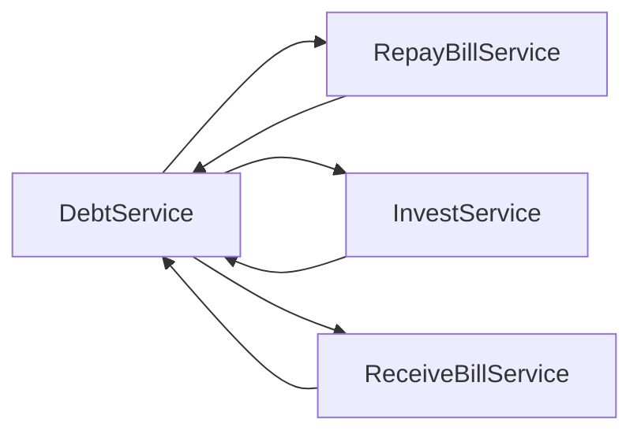

# SpringBoot常见问题

## 配置 jpa could not initialize proxy - no Session

解决方式：在application.yml 加入如下：代码

```yml
spring:
  jpa:
    properties:
      hibernate:
        enable_lazy_load_no_trans: true  # 解决 could not initialize proxy - no Session
```

参考： https://stackoverflow.com/questions/36583185/spring-data-jpa-could-not-initialize-proxy-no-session-with-methods-marke


## SpringBoot 循环依赖实战解决方案


### 🔥 典型问题场景

#### 错误现象
项目引入 Shiro 后启动报错：
```bash
Error creating bean with name 'debtServiceImpl':
Bean with name 'debtServiceImpl' has been injected into other beans
[repayBillServiceImpl,investServiceImpl,receiveBillServiceImpl]
in its raw version as part of a circular reference, but has eventually been wrapped...
```

#### 问题根因


Spring 在创建 `debtServiceImpl` 时发现循环依赖：多个 Service 相互注入，容器无法确定初始化顺序。

### 💡 Spring 循环依赖机制简析

#### 能解决的情况
- ✅ **单例 Bean** + **字段注入**（@Autowired）
- ✅ **单例 Bean** + **Setter注入**

#### 无法解决的情况  
- ❌ **构造器注入**
- ❌ **原型作用域**（@Scope("prototype")）
- ❌ **@Configuration** + **@Bean** 方法间循环调用

### 🚀 三种实战解决方案

#### 方案一：@Lazy 延迟注入（推荐★★★★★）

**原理**：Spring 为被 `@Lazy` 标记的依赖生成代理对象，延迟到真正使用时才初始化。

```java
@Service
public class DebtServiceImpl implements DebtService {
    
    @Lazy  // 🔑 关键注解
    @Autowired
    private RepayBillService repayBillService;
    
    @Lazy
    @Autowired  
    private InvestService investService;
    
    // 其他依赖正常注入...
}
```

**适用场景**：
- 🎯 应急修复，零配置文件修改
- 🎯 SpringBoot 纯注解项目
- 🎯 需要快速上线的紧急情况

**注意事项**：
- ⚠️ 只对字段注入和Setter注入有效
- ⚠️ 构造器参数加 `@Lazy` 无效
- ⚠️ 不要过度使用，会影响启动时的错误发现

#### 方案二：XML配置 lazy-init（兼容性方案）

```xml
<!-- 适用于混合配置的老项目 -->
<bean id="debtService" class="com.example.DebtServiceImpl" lazy-init="true"/>
<bean id="repayBillService" class="com.example.RepayBillServiceImpl" lazy-init="true"/>
```

**适用场景**：
- 🎯 维护老旧XML配置项目  
- 🎯 混合使用XML和注解的项目

#### 方案三：重构解耦（治本方案★★★★★）

**3.1 提取公共服务**
```java
// 原来：A ↔ B 相互调用
// 重构：A → C ← B，提取公共逻辑

@Service
public class BillCalculationService {
    public BigDecimal calculateAmount(BillInfo info) {
        // 公共计算逻辑
    }
}

@Service
public class DebtServiceImpl {
    @Autowired
    private BillCalculationService calculationService; // 单向依赖
}
```

**3.2 事件驱动解耦**
```java
@Service
public class DebtServiceImpl {
    
    @Autowired
    private ApplicationEventPublisher eventPublisher;
    
    public void processDebt(DebtInfo debt) {
        // 处理债务逻辑
        
        // 发布事件而非直接调用其他服务
        eventPublisher.publishEvent(new DebtProcessedEvent(debt));
    }
}

@EventListener
@Component  
public class BillEventHandler {
    
    public void handleDebtProcessed(DebtProcessedEvent event) {
        // 处理账单相关逻辑
    }
}
```

**3.3 领域服务拆分**
```java
// 按业务聚合拆分，避免大而全的Service

@Service
public class DebtDomainService {
    // 只处理债务核心逻辑
}

@Service  
public class BillDomainService {
    // 只处理账单核心逻辑
}

@Service
public class DebtApplicationService {
    @Autowired
    private DebtDomainService debtDomainService;
    
    @Autowired
    private BillDomainService billDomainService;
    
    // 协调多个领域服务，但不产生循环依赖
}
```

### 📋 解决方案选择指南

| 场景 | 推荐方案 | 时间成本 | 技术债务 |
|------|----------|----------|----------|
| **紧急上线** | @Lazy | 5分钟 | 中等 |
| **老项目维护** | lazy-init | 10分钟 | 中等 |  
| **新功能开发** | 重构解耦 | 1-2天 | 无 |
| **架构重构** | 事件驱动 + 领域拆分 | 1-2周 | 无 |

### 🎯 最佳实践建议

#### ✅ 推荐做法
- 设计阶段避免循环依赖，采用单向依赖
- 使用领域驱动设计，按聚合根组织代码
- 事件驱动架构减少服务间直接耦合
- @Lazy 仅用于应急，后续计划重构

#### ❌ 避免做法  
- 不要在所有依赖上都加 @Lazy
- 不要忽视循环依赖背后的设计问题
- 不要在构造器注入中使用 @Lazy
- 不要把 @Lazy 当作长期解决方案

---

### 🔧 扩展阅读

- [Spring官方文档：循环依赖处理机制](https://docs.spring.io/spring-framework/docs/current/reference/html/core.html#beans-dependency-resolution)
- [领域驱动设计在Spring中的实践](https://spring.io/blog/2020/01/08/ddd-sample)
- [Spring事件驱动编程指南](https://spring.io/blog/2015/02/11/better-application-events-in-spring-framework-4-2)
- [第三方教程](https://blog.csdn.net/jinhu_zpf/article/details/78468250)


## Spring Boot 2.x中的management.security.enabled=false无效问题

https://blog.csdn.net/qq_27385301/article/details/82899303

## Spring Boot 2.x和Spring Security 5.x后禁用认证

https://blog.csdn.net/weixin_34335458/article/details/91448954

## 