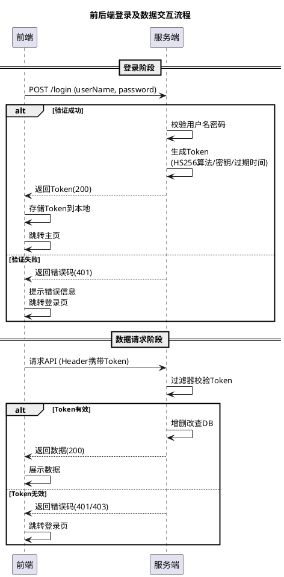

# SpringBoot SseEmitter实时推送应用

## 简介

Server-Sent Events (SSE) 是一种HTML5技术，允许服务器主动向客户端推送数据。SpringBoot通过`SseEmitter`类提供了对SSE的原生支持，使得实现实时通信变得简单而高效。

## 什么是SSE？

SSE是一种单向通信协议，具有以下特点：
- **单向通信**：只能服务器向客户端推送数据
- **基于HTTP**：使用标准HTTP协议，无需额外协议
- **自动重连**：客户端会自动重新连接断开的连接
- **轻量级**：相比WebSocket更轻量，适合单向数据推送场景

## 项目依赖

首先，在`pom.xml`中添加SpringBoot Web依赖：

```xml
<dependencies>
    <dependency>
        <groupId>org.springframework.boot</groupId>
        <artifactId>spring-boot-starter-web</artifactId>
    </dependency>
    <dependency>
        <groupId>org.springframework.boot</groupId>
        <artifactId>spring-boot-starter-test</artifactId>
        <scope>test</scope>
    </dependency>
</dependencies>
```

## 基础实现

### 1. 创建SSE控制器

```java
@RestController
@RequestMapping("/sse")
@Slf4j
public class SseController {
    
    private final Map<String, SseEmitter> emitters = new ConcurrentHashMap<>();
    
    /**
     * 建立SSE连接
     */
    @GetMapping("/connect/{userId}")
    public SseEmitter connect(@PathVariable String userId) {
        // 设置超时时间为30分钟
        SseEmitter emitter = new SseEmitter(30 * 60 * 1000L);
        
        // 保存连接
        emitters.put(userId, emitter);
        
        // 连接完成后的回调
        emitter.onCompletion(() -> {
            log.info("用户 {} 的SSE连接已完成", userId);
            emitters.remove(userId);
        });
        
        // 连接超时后的回调
        emitter.onTimeout(() -> {
            log.warn("用户 {} 的SSE连接超时", userId);
            emitters.remove(userId);
        });
        
        // 连接异常后的回调
        emitter.onError(throwable -> {
            log.error("用户 {} 的SSE连接发生错误: {}", userId, throwable.getMessage());
            emitters.remove(userId);
        });
        
        try {
            // 发送连接成功消息
            emitter.send(SseEmitter.event()
                    .name("connect")
                    .data("连接成功")
                    .id(UUID.randomUUID().toString()));
        } catch (IOException e) {
            log.error("发送连接确认消息失败", e);
        }
        
        return emitter;
    }
    
    /**
     * 向指定用户发送消息
     */
    @PostMapping("/send/{userId}")
    public ResponseEntity<String> sendMessage(@PathVariable String userId, @RequestBody String message) {
        SseEmitter emitter = emitters.get(userId);
        if (emitter == null) {
            return ResponseEntity.badRequest().body("用户未连接");
        }
        
        try {
            emitter.send(SseEmitter.event()
                    .name("message")
                    .data(message)
                    .id(UUID.randomUUID().toString()));
            return ResponseEntity.ok("消息发送成功");
        } catch (IOException e) {
            log.error("发送消息失败", e);
            emitters.remove(userId);
            return ResponseEntity.status(500).body("消息发送失败");
        }
    }
    
    /**
     * 广播消息给所有连接的用户
     */
    @PostMapping("/broadcast")
    public ResponseEntity<String> broadcast(@RequestBody String message) {
        List<String> failedUsers = new ArrayList<>();
        
        emitters.forEach((userId, emitter) -> {
            try {
                emitter.send(SseEmitter.event()
                        .name("broadcast")
                        .data(message)
                        .id(UUID.randomUUID().toString()));
            } catch (IOException e) {
                log.error("向用户 {} 广播消息失败", userId, e);
                failedUsers.add(userId);
            }
        });
        
        // 清理失败的连接
        failedUsers.forEach(emitters::remove);
        
        return ResponseEntity.ok(String.format("广播完成，成功: %d，失败: %d", 
                emitters.size(), failedUsers.size()));
    }
    
    /**
     * 获取当前连接数
     */
    @GetMapping("/count")
    public ResponseEntity<Integer> getConnectionCount() {
        return ResponseEntity.ok(emitters.size());
    }
}
```

### 2. 前端HTML示例

```html
<!DOCTYPE html>
<html>
<head>
    <title>SSE实时通信演示</title>
    <meta charset="UTF-8">
</head>
<body>
    <h1>SSE实时通信演示</h1>
    
    <div>
        <label>用户ID: </label>
        <input type="text" id="userId" value="user123">
        <button onclick="connect()">连接</button>
        <button onclick="disconnect()">断开连接</button>
    </div>
    
    <div style="margin-top: 20px;">
        <label>发送消息: </label>
        <input type="text" id="messageInput" placeholder="输入消息">
        <button onclick="sendMessage()">发送给自己</button>
        <button onclick="broadcast()">广播</button>
    </div>
    
    <div style="margin-top: 20px;">
        <h3>接收到的消息:</h3>
        <div id="messages" style="border: 1px solid #ccc; height: 300px; overflow-y: auto; padding: 10px;"></div>
    </div>

    <script>
        let eventSource = null;
        
        function connect() {
            const userId = document.getElementById('userId').value;
            if (!userId) {
                alert('请输入用户ID');
                return;
            }
            
            if (eventSource) {
                eventSource.close();
            }
            
            eventSource = new EventSource(`/sse/connect/${userId}`);
            
            // 监听连接事件
            eventSource.addEventListener('connect', function(event) {
                addMessage('系统', event.data, 'green');
            });
            
            // 监听普通消息
            eventSource.addEventListener('message', function(event) {
                addMessage('消息', event.data, 'blue');
            });
            
            // 监听广播消息
            eventSource.addEventListener('broadcast', function(event) {
                addMessage('广播', event.data, 'orange');
            });
            
            // 监听连接打开
            eventSource.onopen = function(event) {
                addMessage('系统', 'SSE连接已建立', 'green');
            };
            
            // 监听错误
            eventSource.onerror = function(event) {
                addMessage('系统', 'SSE连接发生错误', 'red');
            };
        }
        
        function disconnect() {
            if (eventSource) {
                eventSource.close();
                addMessage('系统', 'SSE连接已断开', 'red');
            }
        }
        
        function sendMessage() {
            const userId = document.getElementById('userId').value;
            const message = document.getElementById('messageInput').value;
            
            if (!userId || !message) {
                alert('请输入用户ID和消息内容');
                return;
            }
            
            fetch(`/sse/send/${userId}`, {
                method: 'POST',
                headers: {
                    'Content-Type': 'text/plain'
                },
                body: message
            }).then(response => response.text())
              .then(data => console.log(data));
            
            document.getElementById('messageInput').value = '';
        }
        
        function broadcast() {
            const message = document.getElementById('messageInput').value;
            
            if (!message) {
                alert('请输入消息内容');
                return;
            }
            
            fetch('/sse/broadcast', {
                method: 'POST',
                headers: {
                    'Content-Type': 'text/plain'
                },
                body: message
            }).then(response => response.text())
              .then(data => console.log(data));
            
            document.getElementById('messageInput').value = '';
        }
        
        function addMessage(type, content, color) {
            const messagesDiv = document.getElementById('messages');
            const messageDiv = document.createElement('div');
            messageDiv.style.color = color;
            messageDiv.innerHTML = `<strong>[${new Date().toLocaleTimeString()}] ${type}:</strong> ${content}`;
            messagesDiv.appendChild(messageDiv);
            messagesDiv.scrollTop = messagesDiv.scrollHeight;
        }
    </script>
</body>
</html>
```

## 高级用法

### 1. 消息包装类

```java
@Data
@AllArgsConstructor
@NoArgsConstructor
public class SseMessage {
    private String type;        // 消息类型
    private String content;     // 消息内容
    private Long timestamp;     // 时间戳
    private String sender;      // 发送者
    private Map<String, Object> data; // 扩展数据
    
    public static SseMessage create(String type, String content) {
        return new SseMessage(type, content, System.currentTimeMillis(), "system", null);
    }
}
```

### 2. 改进的SSE服务

```java
@Service
@Slf4j
public class SseService {
    
    private final Map<String, SseEmitter> emitters = new ConcurrentHashMap<>();
    private final ObjectMapper objectMapper = new ObjectMapper();
    
    /**
     * 创建连接
     */
    public SseEmitter createConnection(String userId) {
        // 如果用户已存在连接，先关闭旧连接
        removeConnection(userId);
        
        SseEmitter emitter = new SseEmitter(0L); // 0表示永不超时
        emitters.put(userId, emitter);
        
        setupCallbacks(userId, emitter);
        sendMessage(userId, SseMessage.create("connect", "连接建立成功"));
        
        log.info("用户 {} 建立SSE连接，当前连接数: {}", userId, emitters.size());
        return emitter;
    }
    
    /**
     * 发送消息给指定用户
     */
    public boolean sendMessage(String userId, SseMessage message) {
        SseEmitter emitter = emitters.get(userId);
        if (emitter == null) {
            return false;
        }
        
        try {
            String jsonData = objectMapper.writeValueAsString(message);
            emitter.send(SseEmitter.event()
                    .name(message.getType())
                    .data(jsonData)
                    .id(String.valueOf(message.getTimestamp())));
            return true;
        } catch (Exception e) {
            log.error("发送消息给用户 {} 失败", userId, e);
            removeConnection(userId);
            return false;
        }
    }
    
    /**
     * 广播消息
     */
    public void broadcast(SseMessage message) {
        List<String> failedUsers = new ArrayList<>();
        
        emitters.forEach((userId, emitter) -> {
            if (!sendMessage(userId, message)) {
                failedUsers.add(userId);
            }
        });
        
        log.info("广播消息完成，成功: {}，失败: {}", emitters.size() - failedUsers.size(), failedUsers.size());
    }
    
    /**
     * 移除连接
     */
    public void removeConnection(String userId) {
        SseEmitter emitter = emitters.remove(userId);
        if (emitter != null) {
            try {
                emitter.complete();
            } catch (Exception e) {
                log.warn("关闭用户 {} 的SSE连接时发生异常", userId, e);
            }
        }
    }
    
    /**
     * 获取在线用户列表
     */
    public Set<String> getOnlineUsers() {
        return new HashSet<>(emitters.keySet());
    }
    
    /**
     * 设置回调函数
     */
    private void setupCallbacks(String userId, SseEmitter emitter) {
        emitter.onCompletion(() -> {
            log.info("用户 {} 的SSE连接正常关闭", userId);
            emitters.remove(userId);
        });
        
        emitter.onTimeout(() -> {
            log.warn("用户 {} 的SSE连接超时", userId);
            emitters.remove(userId);
        });
        
        emitter.onError(throwable -> {
            log.error("用户 {} 的SSE连接发生错误", userId, throwable);
            emitters.remove(userId);
        });
    }
}
```

### 3. 心跳检测

```java
@Component
@Slf4j
public class SseHeartbeatTask {
    
    @Autowired
    private SseService sseService;
    
    /**
     * 每30秒发送一次心跳
     */
    @Scheduled(fixedRate = 30000)
    public void sendHeartbeat() {
        SseMessage heartbeat = SseMessage.create("heartbeat", "ping");
        sseService.broadcast(heartbeat);
        log.debug("发送心跳包，当前连接数: {}", sseService.getOnlineUsers().size());
    }
}
```

## 实际应用场景

### 1. 实时通知系统

```java
@RestController
@RequestMapping("/notification")
public class NotificationController {
    
    @Autowired
    private SseService sseService;
    
    /**
     * 发送系统通知
     */
    @PostMapping("/system")
    public ResponseEntity<String> sendSystemNotification(@RequestBody NotificationRequest request) {
        SseMessage message = new SseMessage();
        message.setType("notification");
        message.setContent(request.getContent());
        message.setTimestamp(System.currentTimeMillis());
        message.setSender("system");
        
        if (request.isGlobal()) {
            sseService.broadcast(message);
            return ResponseEntity.ok("系统通知发送成功");
        } else {
            boolean success = sseService.sendMessage(request.getUserId(), message);
            return success ? ResponseEntity.ok("通知发送成功") : ResponseEntity.badRequest().body("用户不在线");
        }
    }
}
```

### 2. 实时日志推送

```java
@RestController
@RequestMapping("/logs")
public class LogStreamController {
    
    @Autowired
    private SseService sseService;
    
    /**
     * 开始推送日志
     */
    @PostMapping("/start/{userId}")
    public ResponseEntity<String> startLogStream(@PathVariable String userId) {
        // 启动日志监控线程
        new Thread(() -> {
            try (BufferedReader reader = Files.newBufferedReader(Paths.get("/var/log/application.log"))) {
                String line;
                while ((line = reader.readLine()) != null) {
                    SseMessage logMessage = SseMessage.create("log", line);
                    sseService.sendMessage(userId, logMessage);
                    Thread.sleep(100); // 避免过快推送
                }
            } catch (Exception e) {
                log.error("日志推送异常", e);
            }
        }).start();
        
        return ResponseEntity.ok("开始推送日志");
    }
}
```

## 参考资料

- https://www.cnblogs.com/jun1019/p/10886079.html
- https://www.jianshu.com/p/9a0e802b2297
- https://www.cnblogs.com/yejg1212/p/9603544.html

## 总结

SpringBoot的SseEmitter为实现服务器向客户端的实时数据推送提供了简单而强大的解决方案。通过合理的架构设计和错误处理，SSE可以很好地满足实时通知、日志推送、数据更新等场景的需求。相比WebSocket，SSE更适合单向数据推送的场景，具有实现简单、自动重连等优势。




