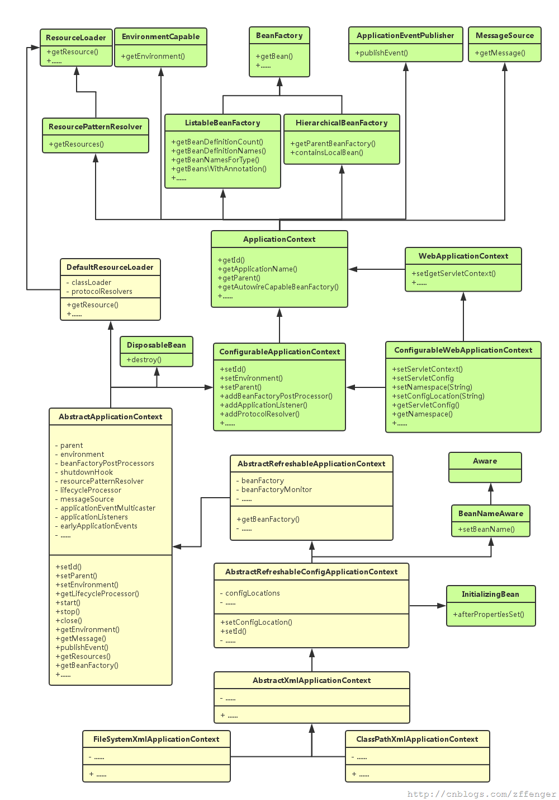

# Spring源码分析：ApplicationContext架构设计深度解析

## 前言

Spring Framework作为Java生态系统中最重要的框架之一，其优秀的架构设计和接口抽象一直是开发者学习的典范。ApplicationContext作为Spring的核心组件，承担着Bean管理、资源加载、事件发布等多项重要职责。本文将深入分析ApplicationContext的接口架构体系，探讨其设计思想和实现原理。

## ApplicationContext的核心地位

在Spring应用中，ApplicationContext是我们接触最多的组件之一。每当我们需要获取Bean实例时，都需要通过ApplicationContext来实现。它隶属于`org.springframework.context`包，是SpringFramework中的Bean管理者，为Spring的诸多功能提供基础支撑。



## BeanFactory系列接口分析

### BeanFactory - 顶层抽象

```java
public interface BeanFactory
```

BeanFactory是Spring管理Bean的最顶层接口，定义了Bean容器的基本规范：

- **容器功能**：管理一系列Bean对象
- **标识机制**：每个Bean使用String类型的name（或id）唯一标识
- **作用域支持**：支持prototype和singleton两种Bean作用域
- **依赖注入**：提倡使用依赖注入方式装配Bean
- **配置来源**：支持从XML文件、properties文件甚至数据库加载Bean定义

### HierarchicalBeanFactory - 层级管理

```java
public interface HierarchicalBeanFactory extends BeanFactory
```

引入了层级概念，具有以下特性：

- **父子关系**：拥有`parentBeanFactory`属性
- **查找机制**：当前BeanFactory找不到Bean时，会向父级查找
- **覆盖能力**：子级可以override父级的同名Bean

这种设计在Web应用中非常有用，可以实现每个Servlet拥有独立的context，同时共享父级context。

### ListableBeanFactory - 枚举能力

```java
public interface ListableBeanFactory extends BeanFactory
```

提供了枚举功能：

- **批量操作**：可以列举出当前BeanFactory中的所有Bean
- **范围限制**：只返回当前BeanFactory的Bean，不包括父级的

## 功能扩展接口群

Spring通过一系列功能性接口，为ApplicationContext提供了丰富的能力：

### 配置与环境管理
- **PropertyResolver**：配置文件解析器的顶级接口
- **Environment**：提供应用运行时的环境信息
- **EnvironmentCapable**：Environment的持有者接口

### 消息与事件处理
- **MessageSource**：消息解析策略接口，支持国际化功能
- **ApplicationEventPublisher**：事件发布接口，实现观察者模式

### 资源加载
- **ResourcePatternResolver**：基于路径模式的资源加载器

## ApplicationContext接口设计分析

```java
public interface ApplicationContext extends 
    EnvironmentCapable, 
    ListableBeanFactory, 
    HierarchicalBeanFactory, 
    MessageSource, 
    ApplicationEventPublisher, 
    ResourcePatternResolver
```

### 设计思想解析

ApplicationContext的设计体现了**接口隔离原则**和**单一职责原则**：

1. **功能聚合**：通过继承多个接口，集成了众多功能
2. **职责明确**：每个父接口都有明确的单一职责
3. **能力组合**：将不同能力组合成一个强大的应用上下文

### 核心能力矩阵

| 能力域 | 接口来源 | 主要功能 |
|--------|----------|----------|
| Bean管理 | ListableBeanFactory, HierarchicalBeanFactory | Bean的创建、获取、生命周期管理 |
| 资源加载 | ResourcePatternResolver | 配置文件、静态资源的加载 |
| 消息处理 | MessageSource | 国际化消息解析 |
| 事件机制 | ApplicationEventPublisher | 事件的发布与监听 |
| 环境配置 | EnvironmentCapable | 环境变量、配置属性管理 |

## ApplicationContext子接口体系

### ConfigurableApplicationContext
```java
public interface ConfigurableApplicationContext extends 
    ApplicationContext, Lifecycle, Closeable
```

**设计目的**：ApplicationContext本身是只读的，该接口提供配置能力

**扩展功能**：
- **可配置性**：提供setId()、setParent()、setEnvironment()等配置方法
- **生命周期管理**：继承Lifecycle，提供start()、stop()等方法
- **资源清理**：继承Closeable，支持优雅关闭和资源释放

### WebApplicationContext
```java
public interface WebApplicationContext extends ApplicationContext
```

**专门化设计**：针对Web应用的特殊需求

**Web特性**：
- 提供getServletContext()方法
- 与Servlet容器集成
- 支持Web特有的Bean作用域（request、session等）

### ConfigurableWebApplicationContext
```java
public interface ConfigurableWebApplicationContext extends 
    WebApplicationContext, ConfigurableApplicationContext
```

**能力融合**：结合了Web特性和配置能力

**应用场景**：Web应用中可配置、可管理、可关闭的ApplicationContext

## 实现类架构设计分析

### ClassPathXmlApplicationContext继承体系

```
AbstractApplicationContext
    ↓
AbstractRefreshableApplicationContext
    ↓
AbstractRefreshableConfigApplicationContext
    ↓
AbstractXmlApplicationContext
    ↓
ClassPathXmlApplicationContext
```

### AbstractApplicationContext - 核心实现

作为继承体系的顶层抽象类，AbstractApplicationContext采用了**模板方法模式**：

#### 1. 配置能力实现
```java
@Override
public void setParent(ApplicationContext parent) {
    this.parent = parent;
    if (parent != null) {
        Environment parentEnvironment = parent.getEnvironment();
        if (parentEnvironment instanceof ConfigurableEnvironment) {
            getEnvironment().merge((ConfigurableEnvironment) parentEnvironment);
        }
    }
}
```

#### 2. 生命周期管理
```java
@Override
public void start() {
    getLifecycleProcessor().start();
    publishEvent(new ContextStartedEvent(this));
}
```
**委托模式**：将生命周期管理委托给LifecycleProcessor

#### 3. 资源清理
```java
@Override
public void close() {
    synchronized (this.startupShutdownMonitor) {
        doClose();
        if (this.shutdownHook != null) {
            try {
                Runtime.getRuntime().removeShutdownHook(this.shutdownHook);
            } catch (IllegalStateException ex) {
                // VM正在关闭时忽略
            }
        }
    }
}
```

#### 4. 环境管理
```java
@Override
public ConfigurableEnvironment getEnvironment() {
    if (this.environment == null) {
        this.environment = createEnvironment();
    }
    return this.environment;
}
```
**懒加载模式**：Environment实例的延迟创建

#### 5. 事件发布机制
```java
@Override
public void publishEvent(ApplicationEvent event) {
    Assert.notNull(event, "Event must not be null");
    getApplicationEventMulticaster().multicastEvent(event);
    if (this.parent != null) {
        this.parent.publishEvent(event);
    }
}
```
**层级传播**：事件会向父级ApplicationContext传播

#### 6. Bean管理的委托实现
```java
@Override
public Object getBean(String name) throws BeansException {
    assertBeanFactoryActive();
    return getBeanFactory().getBean(name);
}

// 抽象方法，由子类实现
public abstract ConfigurableListableBeanFactory getBeanFactory() 
    throws IllegalStateException;
```

**委托模式的巧妙运用**：AbstractApplicationContext本身并不实现Bean管理逻辑，而是委托给内部的ConfigurableListableBeanFactory实例。

## 设计模式分析

### 1. 模板方法模式
AbstractApplicationContext定义了ApplicationContext的骨架算法，将变化的部分抽象为protected或abstract方法供子类实现。

### 2. 委托模式
对于复杂的功能实现，AbstractApplicationContext采用委托模式：
- BeanFactory功能 → ConfigurableListableBeanFactory
- 消息处理 → MessageSource实例  
- 资源加载 → ResourcePatternResolver实例
- 生命周期管理 → LifecycleProcessor实例

### 3. 组合模式
ApplicationContext通过接口继承实现功能组合，避免了实现类的过度复杂化。

## 架构设计原则体现

### 1. 开闭原则
- **对扩展开放**：通过接口继承和抽象方法，支持功能扩展
- **对修改封闭**：核心逻辑在抽象类中稳定实现

### 2. 单一职责原则
每个接口都有明确的单一职责，ApplicationContext通过组合获得多种能力。

### 3. 依赖倒置原则
高层模块（ApplicationContext）依赖于抽象（各种接口），而不依赖于具体实现。

### 4. 接口隔离原则
将大的接口拆分为多个小接口，客户端只需要依赖它们需要的接口。

## 实践应用建议

### 1. 选择合适的ApplicationContext实现
- **普通应用**：使用ConfigurableApplicationContext的实现类
- **Web应用**：使用ConfigurableWebApplicationContext的实现类

### 2. 理解层级关系
在复杂应用中，可以利用ApplicationContext的层级特性实现配置的分层管理。

### 3. 合理使用事件机制
通过ApplicationEventPublisher实现松耦合的组件通信。

## 总结

Spring ApplicationContext的架构设计是软件工程中的经典案例，它通过精心的接口设计和巧妙的设计模式运用，实现了功能的高内聚、低耦合。其核心设计思想包括：

1. **接口驱动设计**：通过接口组合实现功能聚合
2. **委托模式运用**：将复杂功能委托给专门的组件实现
3. **模板方法应用**：在抽象类中定义稳定算法骨架
4. **层级结构支持**：满足复杂应用的分层需求

这种设计不仅为Spring Framework提供了强大而灵活的基础架构，也为我们在日常开发中进行架构设计提供了宝贵的参考和借鉴。理解ApplicationContext的设计思想，有助于我们更好地运用Spring框架，也能提升我们的软件设计能力。