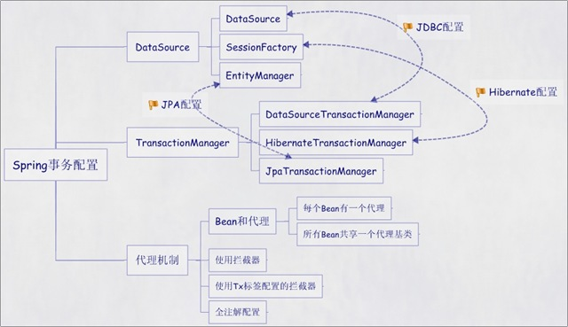

# Spring 事务配置指南

Spring 框架提供了两种事务处理机制：**声明式事务**和**编程式事务**。本指南将详细介绍各种配置方式，并提供最佳实践建议。



## 一、声明式事务（推荐）

声明式事务是 Spring 推荐的事务管理方式，它基于 AOP（面向切面编程）实现，通过拦截目标方法来管理事务的开启、提交和回滚。

### 核心优势
- **代码简洁**：业务代码与事务管理代码分离
- **配置灵活**：通过配置文件或注解进行事务规则声明
- **维护性强**：事务逻辑集中管理，便于维护

### 基础配置组件

所有声明式事务配置都包含三个核心组件：

```xml
<!-- 1. 数据源配置 -->
<bean id="dataSource" class="com.zaxxer.hikari.HikariDataSource">
    <property name="jdbcUrl" value="jdbc:mysql://localhost:3306/mydb"/>
    <property name="username" value="root"/>
    <property name="password" value="password"/>
</bean>

<!-- 2. SessionFactory 配置（Hibernate 示例）-->
<bean id="sessionFactory" class="org.springframework.orm.hibernate5.LocalSessionFactoryBean">
    <property name="dataSource" ref="dataSource"/>
    <property name="configLocation" value="classpath:hibernate.cfg.xml"/>
    <property name="configurationClass" value="org.hibernate.cfg.AnnotationConfiguration"/>
</bean>

<!-- 3. 事务管理器配置 -->
<bean id="transactionManager" class="org.springframework.orm.hibernate5.HibernateTransactionManager">
    <property name="sessionFactory" ref="sessionFactory"/>
</bean>
```

## 二、五种声明式事务配置方式

### 方式一：每个 Bean 独立代理（不推荐）

适用场景：需要为不同 Bean 配置不同事务属性的情况。

```xml
<!-- 目标 Bean -->
<bean id="userDaoTarget" class="com.example.dao.UserDaoImpl">
    <property name="sessionFactory" ref="sessionFactory"/>
</bean>

<!-- 事务代理 Bean -->
<bean id="userDao" class="org.springframework.transaction.interceptor.TransactionProxyFactoryBean">
    <property name="transactionManager" ref="transactionManager"/>
    <property name="target" ref="userDaoTarget"/>
    <property name="proxyInterfaces" value="com.example.dao.UserDao"/>
    <property name="transactionAttributes">
        <props>
            <prop key="save*">PROPAGATION_REQUIRED</prop>
            <prop key="update*">PROPAGATION_REQUIRED</prop>
            <prop key="delete*">PROPAGATION_REQUIRED</prop>
            <prop key="get*">PROPAGATION_REQUIRED,readOnly</prop>
            <prop key="find*">PROPAGATION_REQUIRED,readOnly</prop>
        </props>
    </property>
</bean>
```

### 方式二：共享代理基类（中等推荐）

适用场景：多个 Bean 使用相同事务配置的情况。

```xml
<!-- 事务代理基类 -->
<bean id="transactionBase" 
      class="org.springframework.transaction.interceptor.TransactionProxyFactoryBean" 
      lazy-init="true" abstract="true">
    <property name="transactionManager" ref="transactionManager"/>
    <property name="transactionAttributes">
        <props>
            <prop key="save*">PROPAGATION_REQUIRED</prop>
            <prop key="update*">PROPAGATION_REQUIRED</prop>
            <prop key="delete*">PROPAGATION_REQUIRED</prop>
            <prop key="get*">PROPAGATION_REQUIRED,readOnly</prop>
            <prop key="find*">PROPAGATION_REQUIRED,readOnly</prop>
        </props>
    </property>
</bean>

<!-- 具体业务 Bean -->
<bean id="userDaoTarget" class="com.example.dao.UserDaoImpl">
    <property name="sessionFactory" ref="sessionFactory"/>
</bean>

<bean id="userDao" parent="transactionBase">
    <property name="target" ref="userDaoTarget"/>
</bean>
```

### 方式三：使用拦截器（推荐）

适用场景：需要对一类 Bean（如所有 DAO 或 Service）统一应用事务的情况。

```xml
<!-- 事务拦截器 -->
<bean id="transactionInterceptor" 
      class="org.springframework.transaction.interceptor.TransactionInterceptor">
    <property name="transactionManager" ref="transactionManager"/>
    <property name="transactionAttributes">
        <props>
            <prop key="save*">PROPAGATION_REQUIRED,-Exception</prop>
            <prop key="update*">PROPAGATION_REQUIRED,-Exception</prop>
            <prop key="delete*">PROPAGATION_REQUIRED,-Exception</prop>
            <prop key="get*">PROPAGATION_REQUIRED,readOnly,+Exception</prop>
            <prop key="find*">PROPAGATION_REQUIRED,readOnly,+Exception</prop>
        </props>
    </property>
</bean>

<!-- 自动代理创建器 -->
<bean class="org.springframework.aop.framework.autoproxy.BeanNameAutoProxyCreator">
    <property name="beanNames">
        <list>
            <value>*Dao</value>
            <value>*Service</value>
        </list>
    </property>
    <property name="interceptorNames">
        <list>
            <value>transactionInterceptor</value>
        </list>
    </property>
</bean>

<!-- 业务 Bean -->
<bean id="userDao" class="com.example.dao.UserDaoImpl">
    <property name="sessionFactory" ref="sessionFactory"/>
</bean>
```

### 方式四：使用 tx 标签配置（强烈推荐）

适用场景：现代 Spring 应用的首选方式，配置清晰，功能强大。

```xml
<!-- 添加命名空间 -->
<beans xmlns="http://www.springframework.org/schema/beans"
       xmlns:xsi="http://www.w3.org/2001/XMLSchema-instance"
       xmlns:tx="http://www.springframework.org/schema/tx"
       xmlns:aop="http://www.springframework.org/schema/aop"
       xsi:schemaLocation="
           http://www.springframework.org/schema/beans 
           http://www.springframework.org/schema/beans/spring-beans.xsd
           http://www.springframework.org/schema/tx 
           http://www.springframework.org/schema/tx/spring-tx.xsd
           http://www.springframework.org/schema/aop 
           http://www.springframework.org/schema/aop/spring-aop.xsd">

<!-- 事务通知配置 -->
<tx:advice id="txAdvice" transaction-manager="transactionManager">
    <tx:attributes>
        <tx:method name="save*" propagation="REQUIRED" rollback-for="Exception"/>
        <tx:method name="update*" propagation="REQUIRED" rollback-for="Exception"/>
        <tx:method name="delete*" propagation="REQUIRED" rollback-for="Exception"/>
        <tx:method name="batch*" propagation="REQUIRED" rollback-for="Exception"/>
        <tx:method name="get*" propagation="REQUIRED" read-only="true"/>
        <tx:method name="find*" propagation="REQUIRED" read-only="true"/>
        <tx:method name="query*" propagation="REQUIRED" read-only="true"/>
        <tx:method name="count*" propagation="REQUIRED" read-only="true"/>
        <tx:method name="*" propagation="REQUIRED" read-only="true"/>
    </tx:attributes>
</tx:advice>

<!-- AOP 配置 -->
<aop:config>
    <aop:pointcut id="txPointcut" 
                  expression="execution(* com.example.service.*.*(..))"/>
    <aop:advisor advice-ref="txAdvice" pointcut-ref="txPointcut"/>
</aop:config>
```

### 方式五：注解配置（最推荐）

适用场景：现代 Spring Boot 应用的标准配置方式。

```xml
<!-- 启用事务注解支持 -->
<tx:annotation-driven transaction-manager="transactionManager"/>
```

或者使用 Java 配置：

```java
@Configuration
@EnableTransactionManagement
public class TransactionConfig {
    
    @Bean
    public PlatformTransactionManager transactionManager(SessionFactory sessionFactory) {
        HibernateTransactionManager manager = new HibernateTransactionManager();
        manager.setSessionFactory(sessionFactory);
        return manager;
    }
}
```

在业务类中使用注解：

```java
@Service
@Transactional(readOnly = true)
public class UserServiceImpl implements UserService {
    
    @Autowired
    private UserDao userDao;
    
    @Override
    @Transactional(rollbackFor = Exception.class)
    public void saveUser(User user) {
        userDao.save(user);
    }
    
    @Override
    @Transactional(propagation = Propagation.REQUIRES_NEW)
    public void batchSaveUsers(List<User> users) {
        for (User user : users) {
            userDao.save(user);
        }
    }
    
    @Override
    public User getUserById(Long id) {
        return userDao.findById(id);
    }
}
```

## 三、编程式事务

编程式事务提供了更细粒度的控制，适用于复杂的事务逻辑场景。

### 方式一：使用 TransactionManager

```java
@Service
public class UserServiceImpl implements UserService {
    
    @Autowired
    private PlatformTransactionManager transactionManager;
    
    @Autowired
    private UserDao userDao;
    
    public void complexBusinessOperation() {
        DefaultTransactionDefinition def = new DefaultTransactionDefinition();
        def.setPropagationBehavior(TransactionDefinition.PROPAGATION_REQUIRED);
        def.setIsolationLevel(TransactionDefinition.ISOLATION_READ_COMMITTED);
        def.setTimeout(30); // 30秒超时
        
        TransactionStatus status = transactionManager.getTransaction(def);
        
        try {
            // 业务逻辑代码块1
            userDao.saveUser(user1);
            
            // 中间可以进行条件判断
            if (someCondition) {
                // 业务逻辑代码块2
                userDao.updateUser(user2);
            } else {
                // 手动回滚
                transactionManager.rollback(status);
                return;
            }
            
            // 提交事务
            transactionManager.commit(status);
        } catch (Exception ex) {
            transactionManager.rollback(status);
            throw ex;
        }
    }
}
```

### 方式二：使用 TransactionTemplate（推荐）

```java
@Service
public class UserServiceImpl implements UserService {
    
    @Autowired
    private TransactionTemplate transactionTemplate;
    
    @Autowired
    private UserDao userDao;
    
    public String processUsers(List<User> users) {
        return transactionTemplate.execute(new TransactionCallback<String>() {
            @Override
            public String doInTransaction(TransactionStatus status) {
                try {
                    for (User user : users) {
                        if (user.isValid()) {
                            userDao.save(user);
                        } else {
                            // 遇到无效数据，标记回滚
                            status.setRollbackOnly();
                            return "处理失败：发现无效用户数据";
                        }
                    }
                    return "处理成功：共处理 " + users.size() + " 个用户";
                } catch (Exception e) {
                    // 异常时自动回滚
                    return "处理失败：" + e.getMessage();
                }
            }
        });
    }
    
    // 使用 Lambda 表达式简化（Java 8+）
    public void simpleOperation() {
        transactionTemplate.executeWithoutResult(status -> {
            userDao.deleteInactiveUsers();
            userDao.updateStatistics();
        });
    }
}
```

## 四、事务属性详解

### 传播行为 (Propagation)

| 传播行为 | 说明 |
|---------|------|
| REQUIRED | 默认值，如果当前存在事务则加入，否则新建事务 |
| SUPPORTS | 如果当前存在事务则加入，否则以非事务方式执行 |
| MANDATORY | 必须在已存在的事务中执行，否则抛出异常 |
| REQUIRES_NEW | 总是新建事务，如果当前存在事务则挂起 |
| NOT_SUPPORTED | 以非事务方式执行，如果当前存在事务则挂起 |
| NEVER | 以非事务方式执行，如果当前存在事务则抛出异常 |
| NESTED | 如果当前存在事务则在嵌套事务内执行 |

### 隔离级别 (Isolation)

| 隔离级别 | 说明 |
|---------|------|
| DEFAULT | 使用数据库默认隔离级别 |
| READ_UNCOMMITTED | 读未提交（最低级别） |
| READ_COMMITTED | 读已提交（Oracle 默认） |
| REPEATABLE_READ | 可重复读（MySQL 默认） |
| SERIALIZABLE | 串行化（最高级别） |

### 其他属性

```java
@Transactional(
    propagation = Propagation.REQUIRED,
    isolation = Isolation.READ_COMMITTED,
    timeout = 30,                    // 事务超时时间（秒）
    readOnly = false,               // 是否为只读事务
    rollbackFor = {Exception.class}, // 指定回滚异常
    noRollbackFor = {RuntimeException.class} // 指定不回滚异常
)
```

## 五、最佳实践建议

### 1. 选择合适的配置方式

- **小型项目**：使用注解配置 (`@Transactional`)
- **中大型项目**：使用 tx 标签配置 + 注解补充
- **复杂事务逻辑**：结合使用声明式和编程式事务

### 2. 事务粒度控制

```java
@Service
@Transactional(readOnly = true) // 类级别默认只读
public class UserService {
    
    @Transactional(rollbackFor = Exception.class) // 方法级别覆盖
    public void saveUser(User user) {
        // 写操作
    }
    
    // 查询操作继承类级别的只读设置
    public User findUser(Long id) {
        return userDao.findById(id);
    }
}
```

### 3. 异常处理策略

```java
@Transactional(
    rollbackFor = {Exception.class},           // 所有检查异常都回滚
    noRollbackFor = {BusinessException.class}  // 业务异常不回滚
)
public void businessMethod() {
    try {
        // 业务逻辑
    } catch (BusinessException e) {
        // 业务异常处理，事务不回滚
        log.warn("业务异常：{}", e.getMessage());
    } catch (Exception e) {
        // 其他异常，事务回滚
        log.error("系统异常", e);
        throw e;
    }
}
```

### 4. 性能优化建议

- **合理设置只读事务**：查询操作使用 `readOnly = true`
- **避免长时间事务**：设置合理的超时时间
- **批处理优化**：大量数据操作考虑分批处理
- **选择合适的隔离级别**：根据业务需求平衡一致性和性能

### 5. Spring Boot 配置示例

```yaml
spring:
  datasource:
    url: jdbc:mysql://localhost:3306/mydb
    username: root
    password: password
    hikari:
      maximum-pool-size: 20
      minimum-idle: 5
      connection-timeout: 20000
      
  jpa:
    hibernate:
      ddl-auto: update
    show-sql: true
    
  transaction:
    default-timeout: 30
    rollback-on-commit-failure: true
```

```java
@SpringBootApplication
@EnableTransactionManagement // 启用事务管理
public class Application {
    public static void main(String[] args) {
        SpringApplication.run(Application.class, args);
    }
}
```

## 六、常见问题及解决方案

### 1. 事务不生效问题

**原因**：
- 方法不是 public
- 类内部方法调用
- 异常被捕获未重新抛出
- 数据库引擎不支持事务

**解决方案**：
```java
@Service
public class UserService {
    
    @Autowired
    private UserService self; // 注入自己解决内部调用问题
    
    public void publicMethod() {
        self.transactionalMethod(); // 通过代理调用
    }
    
    @Transactional
    public void transactionalMethod() {
        // 事务逻辑
    }
}
```

### 2. 数据不一致问题

使用合适的隔离级别和锁机制：

```java
@Transactional(isolation = Isolation.REPEATABLE_READ)
public void updateUserBalance(Long userId, BigDecimal amount) {
    User user = userDao.findByIdForUpdate(userId); // 悲观锁
    user.setBalance(user.getBalance().add(amount));
    userDao.save(user);
}
```

## 相关资源

- [Spring Framework 官方文档 - 事务管理](https://docs.spring.io/spring-framework/docs/current/reference/html/data-access.html#transaction)
- [Spring Boot 官方文档 - 数据访问](https://docs.spring.io/spring-boot/docs/current/reference/html/data.html)
- [Spring 事务管理最佳实践](https://spring.io/guides/gs/managing-transactions/)

