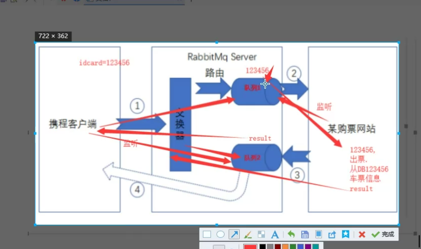

# RabbitMQ入门教程

## 目录

[[toc]]

## RabbitMQ简介

RabbitMQ是一个开源的消息代理和队列服务器，用于应用程序之间的异步消息传递。它基于AMQP（高级消息队列协议）实现，提供可靠的消息传递机制。

**核心概念：**
- **Producer（生产者）**：发送消息的应用程序
- **Consumer（消费者）**：接收消息的应用程序
- **Queue（队列）**：存储消息的缓冲区
- **Exchange（交换器）**：接收生产者消息并路由到队列
- **Binding（绑定）**：交换器和队列之间的路由规则

## Windows环境安装配置

### 安装步骤
1. **前置条件**：确保系统已安装Erlang运行环境
2. **下载安装包**：从RabbitMQ官网下载Windows安装包
3. **安装RabbitMQ**：运行安装程序，按提示完成安装

::: tip
**安装教程文档**

https://www.cnblogs.com/saryli/p/9149455.html

https://www.cnblogs.com/saryli/p/9729591.html

:::


### 启动方式

RabbitMQ在Windows下有两种启动方式：

#### 1. 应用方式启动
```bash
# 后台启动
rabbitmq-server -detached

# 直接启动（前台运行）
rabbitmq-server

# 关闭服务
rabbitmqctl stop
```

#### 2. 服务方式启动
```bash
# 安装服务
rabbitmq-service install

# 启动服务
rabbitmq-service start

# 停止服务
rabbitmq-service stop

# 启用服务
rabbitmq-service enable

# 禁用服务
rabbitmq-service disable

# 查看帮助
rabbitmq-service help
```

**注意事项：**
- 执行`rabbitmq-service install`后，服务默认为启用状态
- 如果设置服务为禁用状态，再执行`rabbitmq-service start`会报错
- 服务正常启动后，使用`disable`命令无效果

### 管理界面

#### 启用管理插件
```bash
# 启动管理插件
rabbitmq-plugins enable rabbitmq_management

# 关闭管理插件
rabbitmq-plugins disable rabbitmq_management
```

#### 访问管理界面
- **URL**：http://localhost:15672/#/
- **默认账号**：guest
- **默认密码**：guest

## Linux环境安装配置

### 目录结构
- **服务安装目录**：`/usr/sbin`
- **日志目录**：`/var/log/rabbitmq`
- **配置文件目录**：`/etc/rabbitmq`

### 启动命令
```bash
# 启动服务
sudo /sbin/service rabbitmq-server start

# 停止服务
sudo /sbin/service rabbitmq-server stop

# 查看状态
sudo rabbitmqctl status
```

### 启动失败处理

**问题现象：**
```
/usr/lib/rabbitmq/bin/rabbitmq-server: line 50: erl: command not found
```

**解决方案：**
```bash
# 创建erlang的erl软连接到/usr/bin目录
ln -s /usr/local/erlang/bin/erl /usr/bin/erl
```

**原因分析：**
环境变量配置问题导致系统无法找到erlang的erl命令。

## 启动与管理

### 基本命令
```bash
# 查看服务状态
rabbitmqctl status

# 停止RabbitMQ节点
rabbitmqctl stop

# 重置RabbitMQ节点
rabbitmqctl reset

# 查看队列信息
rabbitmqctl list_queues

# 查看用户列表
rabbitmqctl list_users
```

## 用户账号管理

### 创建管理员账号

#### 1. 添加用户
```bash
# 语法：rabbitmqctl add_user 用户名 密码
./rabbitmqctl add_user admin admin
```

#### 2. 设置用户角色
```bash
# 设置管理员权限
./rabbitmqctl set_user_tags admin administrator
```

#### 3. 设置访问权限
```bash
# 设置远程访问权限（必须在RabbitMQ运行状态下执行）
./rabbitmqctl set_permissions -p "/" admin ".*" ".*" ".*"
```

**权限参数说明：**
- `-p "/"`: 虚拟主机路径
- `".*" ".*" ".*"`: 分别代表配置权限、写权限、读权限的正则表达式

### 用户角色类型
- **administrator**：管理员，拥有所有权限
- **monitoring**：监控者，可以查看节点相关信息
- **policymaker**：策略制定者，可以设置策略
- **management**：普通管理者，只能登录管理控制台
- **无标签**：普通用户，无法使用管理控制台

## RabbitMq实现方案

### 简单的方案1



## 常见问题处理

### 1. 连接超时异常
**异常信息：**
```
java.util.concurrent.TimeoutException
```

**解决方案：**
在`/etc/hosts`文件中配置IP和域名的对应关系：
```bash
127.0.0.1 localhost your-hostname
```

**原因分析：**
broker没有配置主备，且系统hosts文件未正确配置IP和域名映射，导致producer调用API登录broker时耗时过长。

### 2. 远程访问配置
如果需要远程连接RabbitMQ（如Java项目调用），必须：
1. 创建非guest用户
2. 设置用户权限
3. 确保防火墙开放相应端口（5672用于AMQP，15672用于管理界面）

### 3. 端口说明
- **5672**：AMQP协议端口
- **15672**：HTTP管理界面端口
- **25672**：集群通信端口

## 最佳实践

### 1. 安全配置
- 删除或禁用默认guest用户的远程访问
- 为不同应用创建专用用户
- 使用强密码策略
- 定期更新用户密码

### 2. 性能优化
- 合理设置队列参数
- 监控内存和磁盘使用情况
- 配置合适的预取值(prefetch)
- 使用消息确认机制

### 3. 监控运维
- 定期查看日志文件
- 监控队列长度和消息积压
- 设置告警机制
- 定期备份配置和数据

## 参考资源

### 官方资源
- **RabbitMQ官网**：http://www.rabbitmq.com/
- **官方入门教程**：https://www.rabbitmq.com/getstarted.html
- **RabbitMQ中文文档**：http://rabbitmq.mr-ping.com/

### 集群配置参考
- **集群配置指南**：http://www.rabbitmq.com/clustering.html
- **Celery与RabbitMQ**：http://docs.celeryproject.org/en/latest/getting-started/brokers/rabbitmq.html

### 扩展阅读
- **邮件发送示例**：https://blog.csdn.net/qq_27676247/article/details/91391549
- **远程访问配置**：https://blog.csdn.net/qq_22075041/article/details/78855708

---

通过本教程，您应该能够成功安装、配置和管理RabbitMQ服务。建议在生产环境使用前，先在测试环境中充分验证配置的正确性和稳定性。