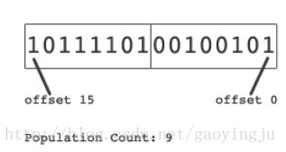
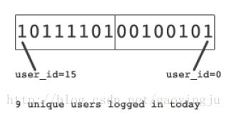
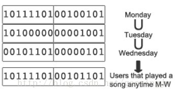

# Redis setbit(bitmap)统计活跃用户

## 目录

[[toc]]

## 概述

在现代互联网应用中，实时统计活跃用户是一个常见且重要的需求。Redis的bitmap功能为我们提供了一个极其高效的解决方案，能够以极低的内存消耗和时间复杂度实现大规模用户活跃度统计。

### 性能表现

- **响应时间**：在模拟1.28亿用户环境下，日活跃用户统计耗时小于50ms
- **内存占用**：仅需16MB内存
- **硬件环境**：MacBook Pro测试环境

## 技术原理

### Bitmap基础概念

**Bitmap（位图）** 是一串连续的二进制数字（0或1），其中：
- 每一位的位置称为偏移量（offset）
- 支持位运算操作：AND、OR、XOR等
- 1表示用户活跃，0表示用户不活跃

**位图计数（Population Count）**
- 统计bitmap中值为1的位的个数
- 高效率：10亿位的bitmap，90%置1的情况下，计数仅需21.1ms
- 硬件优化：SSE4指令集提供硬件级别的位图计数支持



### Redis Bitmap特性

Redis提供了强大的bitmap操作能力：
- **支持二进制键值**：Key和Value都可以是二进制数据
- **setbit操作**：`setbit(key, offset, value)` 时间复杂度O(1)
- **内存高效**：相比传统set存储，内存占用大幅降低

## 实现方案

### 1. 基础实现：日活跃用户统计

#### 核心思路
- 为每天创建一个独立的bitmap
- 用户ID作为偏移量（offset）
- 用户访问时将对应位置设为1

#### Key设计规范
```
daily_active_users:yyyy-mm-dd
play:yyyy-mm-dd-hh
premium:yyyy-mm-dd
```

#### 操作流程
```redis
# 用户登录时执行
SETBIT daily_active_users:2024-01-15 user_id 1

# 统计当日活跃用户数
BITCOUNT daily_active_users:2024-01-15
```

#### 实际案例
假设今日有9个用户登录，用户ID分别为：0,1,3,4,5,6,9,11,15
- Bitmap值：`1011110100100101`
- 统计结果：9个活跃用户



### 2. 高级统计：周/月活跃用户

#### 实现原理
通过对多个日活跃bitmap执行并集运算，获得周/月活跃用户数据。

```redis
# 计算本周活跃用户（假设周一到周日）
BITOP OR weekly_active:2024-W03 daily_active_users:2024-01-15 daily_active_users:2024-01-16 ... daily_active_users:2024-01-21

# 统计周活跃用户数
BITCOUNT weekly_active:2024-W03
```

### 3. 复杂场景：交集统计

#### 示例：11月听歌的高级用户统计
```
(play:2011-11-01 ∪ play:2011-11-02 ∪ ... ∪ play:2011-11-30) ∩ premium:2011-11
```

实现步骤：
1. 计算11月所有听歌用户的并集
2. 与高级用户bitmap求交集
3. 统计最终结果

## 性能测试数据



基于1.28亿用户规模的性能测试结果：

| 统计周期 | 耗时(ms) | 说明 |
|----------|----------|------|
| 日统计   | 50.2     | 单个bitmap计数 |
| 周统计   | 392.0    | 7个bitmap并集运算 |
| 月统计   | 1624.8   | 30个bitmap并集运算 |

## 优化策略

### 1. 结果缓存策略
- **日统计缓存**：直接缓存每日统计结果
- **周统计缓存**：预计算并缓存周统计结果
- **月统计缓存**：预计算并缓存月统计结果

### 2. 缓存带来的额外收益
- **灵活组合统计**：手机用户 ∩ 周活跃用户
- **滑动窗口统计**：过去N天活跃用户（基于缓存的日统计快速计算）
- **快速响应**：复杂查询响应时间降至50ms

### 3. 内存优化
- **数据过期策略**：设置合理的TTL，自动清理历史数据
- **压缩存储**：Redis自动压缩稀疏bitmap
- **分片策略**：超大规模用户可考虑水平分片

## 代码实现

### Java实现示例

#### 单日活跃用户统计
```java
import redis.clients.jedis.Jedis;
import java.util.BitSet;

public class UserActivityStats {
    private Jedis redis = new Jedis("localhost");
    
    /**
     * 统计指定操作在指定日期的活跃用户数
     * @param action 操作类型
     * @param date 日期
     * @return 活跃用户数
     */
    public int uniqueCount(String action, String date) {
        String key = action + ":" + date;
        BitSet users = BitSet.valueOf(redis.get(key.getBytes()));
        return users.cardinality();
    }
    
    /**
     * 记录用户活跃行为
     * @param action 操作类型
     * @param date 日期
     * @param userId 用户ID
     */
    public void recordUserActivity(String action, String date, long userId) {
        String key = action + ":" + date;
        redis.setbit(key, userId, true);
    }
}
```

#### 多日期活跃用户统计
```java
/**
 * 统计指定操作在多个日期的去重活跃用户数
 * @param action 操作类型
 * @param dates 日期数组
 * @return 去重后的活跃用户数
 */
public int uniqueCount(String action, String... dates) {
    BitSet all = new BitSet();
    for (String date : dates) {
        String key = action + ":" + date;
        BitSet users = BitSet.valueOf(redis.get(key.getBytes()));
        all.or(users); // 执行或运算（并集）
    }
    return all.cardinality(); // 返回位图计数
}
```

## 最佳实践

### 1. Key命名规范
```
{action}:{time_period}
例如：
- login:2024-01-15（登录-日）
- play:2024-01-15-14（播放-小时）
- premium:2024-01（高级用户-月）
```

### 2. 用户ID映射
- 确保用户ID连续或建立映射关系
- 避免稀疏用户ID导致内存浪费
- 考虑使用哈希函数将字符串用户ID映射为数字

### 3. 监控告警
- 监控bitmap内存使用量
- 设置统计耗时告警阈值
- 监控Redis连接数和命令执行频率

### 4. 数据一致性
- 使用Redis事务确保原子操作
- 考虑主从复制的数据延迟
- 建立数据校验机制

## 适用场景与限制

### 适用场景
- 日活/月活统计
- 用户行为分析
- A/B测试用户分组
- 实时数据大屏展示

### 使用限制
- 用户ID需要是整数或可映射为整数
- 单个bitmap最大支持2^32个用户
- 稀疏数据会浪费内存空间

## 总结

Redis bitmap为大规模用户活跃度统计提供了一个高效、节省内存的解决方案。通过合理的设计和优化，可以在毫秒级别完成亿级用户的统计任务，为业务决策提供实时数据支持。

该方案特别适合需要快速响应、高并发访问的互联网应用场景，是现代数据分析系统中不可或缺的技术工具。