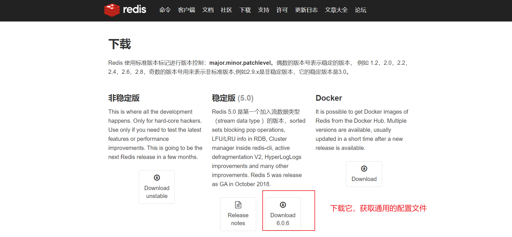
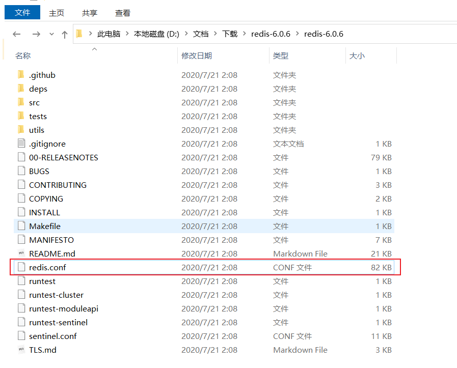

# Redis.conf 配置文件详解

## 概述

Redis 配置文件 `redis.conf` 是 Redis 服务器的核心配置文件，包含了 Redis 服务器运行所需的各种参数设置。本文档将详细解释各个配置项的含义和使用方法。

## 官网下载通用的模板文件

redis中文官方网站：http://www.redis.cn/download.html





通用模版文件

[redis.conf](./file/redis.conf)


## 单位说明

在配置内存大小时，必须带上单位，支持的单位格式如下：

```
1k  => 1000 bytes
1kb => 1024 bytes
1m  => 1000000 bytes
1mb => 1024*1024 bytes
1g  => 1000000000 bytes
1gb => 1024*1024*1024 bytes
```

单位不区分大小写，`1K`、`5GB`、`4M` 都是有效的。

## 核心配置项

### 1. INCLUDES（包含文件）

```conf
# include /path/to/local.conf
# include /path/to/other.conf
```

- 用于包含其他配置文件
- include 配置不能被 `config rewrite` 命令改写
- 建议将 include 放在配置文件最前面，避免运行时配置被覆盖

### 2. 常用基础配置

#### 守护进程设置
```conf
daemonize no
```
- `yes`: Redis 作为守护进程在后台运行
- `no`: Redis 在前台运行（默认）

#### PID 文件
```conf
pidfile /var/run/redis.pid
```
- 指定 Redis 进程 ID 文件的存储位置

#### 端口配置
```conf
port 6379
```
- Redis 监听端口，默认 6379
- 设置为 0 则不监听任何端口

#### TCP 连接配置
```conf
tcp-backlog 511
```
- TCP 监听队列长度
- 高并发环境下需要调高此值
- 同时需要调整系统的 `/proc/sys/net/core/somaxconn` 参数

#### 网络绑定
```conf
bind 127.0.0.1
# bind 192.168.1.100 10.0.0.1
```
- 绑定 Redis 监听的网络接口
- 默认绑定本地回环地址
- 生产环境中注释掉此行以允许外部访问

#### 连接超时
```conf
timeout 0
```
- 客户端空闲超时时间（秒）
- 0 表示永不超时

#### TCP Keepalive
```conf
tcp-keepalive 300
```
- TCP 心跳包间隔时间
- 推荐设置为 60-300 秒
- 防止死连接和网络设备断开连接

### 3. 日志配置

#### 日志级别
```conf
loglevel notice
```
日志级别选项：
- `debug`: 开发测试阶段使用
- `verbose`: 详细信息，但不如 debug 混乱
- `notice`: 生产环境推荐
- `warning`: 仅记录重要警告信息

#### 日志文件
```conf
logfile ""
```
- 指定日志文件路径
- 空字符串表示输出到标准输出

#### 系统日志
```conf
# syslog-enabled no
# syslog-ident redis
# syslog-facility local0
```
- 是否启用系统日志
- 系统日志标识符
- 系统日志设施

### 4. 数据库配置

```conf
databases 16
```
- 数据库数量，默认 16 个（0-15）
- 使用 `SELECT <dbid>` 命令切换数据库

## 持久化配置

### 1. RDB 快照持久化

#### 保存策略
```conf
save 900 1      # 900秒内至少1个key变化则保存
save 300 10     # 300秒内至少10个key变化则保存
save 60 10000   # 60秒内至少10000个key变化则保存
```

#### 保存失败处理
```conf
stop-writes-on-bgsave-error yes
```
- RDB 保存失败时是否停止写操作

#### 压缩设置
```conf
rdbcompression yes
```
- 是否压缩 RDB 文件

#### 校验设置
```conf
rdbchecksum yes
```
- 是否对 RDB 文件进行校验

#### 文件配置
```conf
dbfilename dump.rdb
dir ./
```
- RDB 文件名和存储目录

### 2. AOF 持久化

#### 启用 AOF
```conf
appendonly no
```
- 是否启用 AOF 持久化

#### AOF 文件名
```conf
appendfilename "appendonly.aof"
```

#### 同步策略
```conf
appendfsync everysec
```
同步策略选项：
- `always`: 每次写入都同步（最安全，最慢）
- `everysec`: 每秒同步一次（默认，平衡性能和安全）
- `no`: 由操作系统决定何时同步（最快，最不安全）

#### AOF 重写配置
```conf
no-appendfsync-on-rewrite no
auto-aof-rewrite-percentage 100
auto-aof-rewrite-min-size 64mb
```

## 主从复制配置

### 从服务器配置
```conf
# slaveof <masterip> <masterport>
# masterauth <master-password>
```

### 从服务器行为
```conf
slave-serve-stale-data yes
slave-read-only yes
```

### 复制相关参数
```conf
# repl-ping-slave-period 10
# repl-timeout 60
repl-disable-tcp-nodelay no
# repl-backlog-size 1mb
# repl-backlog-ttl 3600
slave-priority 100
```

## 安全配置

### 密码认证
```conf
# requirepass foobared
```
- 设置 Redis 访问密码
- 建议使用强密码

更多内容参考: [Redis 密码认证指南](./redis-requirepass.md)

### 命令重命名
```conf
# rename-command CONFIG b840fc02d524045429941cc15f59e41cb7be6c52
# rename-command CONFIG ""
```
- 重命名危险命令
- 设置为空字符串可完全禁用命令

## 资源限制

### 客户端连接数
```conf
# maxclients 10000
```
- 最大同时连接的客户端数量

### 内存限制
```conf
# maxmemory <bytes>
```
- 最大内存使用量

### 内存回收策略
```conf
# maxmemory-policy noeviction
```
内存回收策略：
- `volatile-lru`: 使用 LRU 算法移除过期 key
- `allkeys-lru`: 使用 LRU 算法移除所有 key
- `volatile-random`: 随机移除过期 key
- `allkeys-random`: 随机移除任意 key
- `volatile-ttl`: 移除最近过期的 key
- `noeviction`: 不移除任何 key，返回错误

## 集群配置

```conf
# cluster-enabled yes
# cluster-config-file nodes-6379.conf
# cluster-node-timeout 15000
```

## 性能调优

### 慢日志
```conf
slowlog-log-slower-than 10000
slowlog-max-len 128
```

### 客户端输出缓冲区
```conf
client-output-buffer-limit normal 0 0 0
client-output-buffer-limit slave 256mb 64mb 60
client-output-buffer-limit pubsub 32mb 8mb 60
```

### 系统参数
```conf
hz 10
activerehashing yes
```

## 生产环境推荐配置

```conf
# 网络配置
bind 127.0.0.1          # 注释掉以允许外部访问
port 6379
tcp-backlog 511
tcp-keepalive 300

# 基础配置
daemonize yes           # 后台运行
pidfile /var/run/redis.pid
timeout 0

# 日志配置
loglevel notice
logfile "/var/log/redis/redis.log"

# 安全配置
requirepass your_strong_password

# 持久化配置
save 900 1
save 300 10
save 60 10000
rdbcompression yes
rdbchecksum yes
dbfilename dump.rdb
dir /var/lib/redis/

# AOF 配置
appendonly yes
appendfilename "appendonly.aof"
appendfsync everysec
auto-aof-rewrite-percentage 100
auto-aof-rewrite-min-size 64mb

# 内存配置
maxmemory 2gb
maxmemory-policy allkeys-lru

# 性能配置
slowlog-log-slower-than 10000
slowlog-max-len 128
```

## 注意事项

1. **安全性**: 生产环境必须设置密码，限制网络访问
2. **持久化**: 根据业务需求选择合适的持久化策略
3. **内存管理**: 合理设置内存限制和回收策略
4. **监控**: 启用慢日志监控性能问题
5. **备份**: 定期备份 RDB 和 AOF 文件

## 配置验证

启动 Redis 后，可以使用以下命令验证配置：

```bash
redis-cli CONFIG GET "*"           # 查看所有配置
redis-cli CONFIG GET "maxmemory"   # 查看特定配置
redis-cli CONFIG SET "maxmemory" "2gb"  # 动态修改配置
```

通过合理配置 `redis.conf`，可以确保 Redis 服务器在生产环境中稳定、安全、高效地运行。