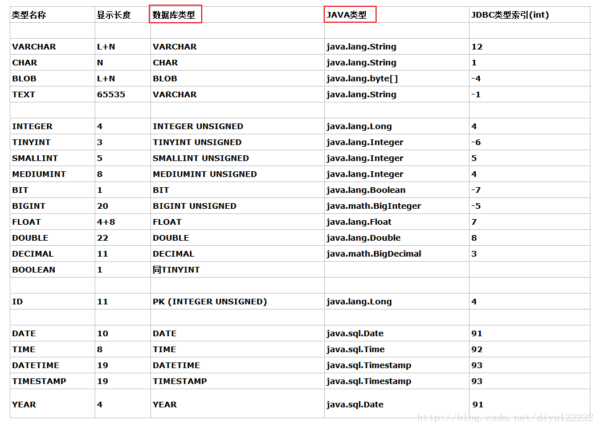

# MySQL大字段存储优化与压缩存储

## 目录

[[toc]]

## 前言

在开发大型系统时，我们经常会遇到需要在MySQL中存储大量文本数据的场景，比如JSON配置、任务详情、日志信息等。当这些字段的大小超过TEXT类型的限制（65KB）时，就需要使用MEDIUMTEXT（16MB）甚至LONGTEXT（4GB），这会显著影响数据库的查询和更新性能。

本教程将介绍如何通过压缩存储来优化MySQL大字段的存储和性能。

参考：https://blog.csdn.net/fenglllle/article/details/103865600

## 问题场景

假设我们有一个业务表，其中包含一个很大的JSON字段：

```sql
CREATE TABLE business (
    businessId INT PRIMARY KEY,
    name VARCHAR(100),
    text MEDIUMTEXT  -- 存储大量JSON数据
);
```

当text字段存储超过2MB的数据时，会遇到以下问题：
- 查询性能下降，单个字段长度超过MySQL的页大小
- 更新操作缓慢
- 存储空间占用过大
- 网络传输开销增加

## 解决方案一：使用MySQL内置压缩函数

### 1. MySQL压缩函数介绍

MySQL提供了三个压缩相关的内置函数：
- `COMPRESS(str)` - 压缩字符串，返回BLOB类型
- `UNCOMPRESS(compressed_data)` - 解压缩数据
- `UNCOMPRESSED_LENGTH(compressed_data)` - 返回压缩前的数据长度

### 2. 基本使用示例

```sql
-- 插入压缩数据
INSERT INTO business (businessId, name, text) 
VALUES (1, '测试业务', COMPRESS('这里是大量的JSON数据...'));

-- 查询并解压缩数据
SELECT businessId, name, UNCOMPRESS(text) as content 
FROM business WHERE businessId = 1;

-- 转换为UTF8字符串（避免乱码）
SELECT businessId, name, 
       CONVERT(UNCOMPRESS(text) USING utf8) as content 
FROM business WHERE businessId = 1;

-- 查看压缩效果
SELECT businessId,
       LENGTH(text) as compressed_size,
       UNCOMPRESSED_LENGTH(text) as original_size,
       ROUND((1 - LENGTH(text) / UNCOMPRESSED_LENGTH(text)) * 100, 2) as compression_ratio
FROM business WHERE businessId = 1;
```

### 3. 压缩效果测试

让我们用实际数据测试压缩效果：

```sql
-- 测试数据（约2.6KB）
SET @test_data = '重复的长文本数据...';

-- 查看原始大小
SELECT LENGTH(@test_data) as original_size;

-- 查看压缩后大小
SELECT LENGTH(COMPRESS(@test_data)) as compressed_size;

-- 压缩比计算
SELECT 
    LENGTH(@test_data) as original_size,
    LENGTH(COMPRESS(@test_data)) as compressed_size,
    ROUND((1 - LENGTH(COMPRESS(@test_data)) / LENGTH(@test_data)) * 100, 2) as compression_ratio;
```

根据测试，对于重复性高的文本数据，压缩比可以达到40-90%，字段越大，压缩效果越明显。

### 4. 注意事项

- 压缩后的数据类型变为BLOB，需要在应用层处理
- 查询时需要使用UNCOMPRESS函数解压
- 建议对压缩后的数据字段使用MEDIUMBLOB或LONGBLOB类型
- 压缩会消耗CPU资源，需要权衡存储空间和CPU开销

## 解决方案二：应用层GZIP压缩

### 1. Java实现GZIP压缩

```java
package com.mysql.compression;

import java.io.ByteArrayInputStream;
import java.io.ByteArrayOutputStream;
import java.util.zip.GZIPInputStream;
import java.util.zip.GZIPOutputStream;

public class GZipUtil {
    
    /**
     * GZIP压缩字符串
     */
    public static String compress(String str) {
        if (str == null || str.trim().length() == 0) {
            return null;
        }
        
        try (ByteArrayOutputStream out = new ByteArrayOutputStream();
             GZIPOutputStream gzip = new GZIPOutputStream(out)) {
            
            gzip.write(str.getBytes("UTF-8"));
            gzip.close();
            
            // 转换为字符串存储（使用ISO-8859-1编码保持字节不变）
            return new String(out.toByteArray(), "ISO-8859-1");
            
        } catch (Exception e) {
            e.printStackTrace();
            return str;
        }
    }
    
    /**
     * GZIP解压缩字符串
     */
    public static String uncompress(String compressedStr) {
        if (compressedStr == null || compressedStr.trim().length() == 0) {
            return null;
        }
        
        try (ByteArrayOutputStream out = new ByteArrayOutputStream();
             ByteArrayInputStream in = new ByteArrayInputStream(
                 compressedStr.getBytes("ISO-8859-1"));
             GZIPInputStream gzipIn = new GZIPInputStream(in)) {
            
            byte[] buffer = new byte[1024];
            int len;
            while ((len = gzipIn.read(buffer)) != -1) {
                out.write(buffer, 0, len);
            }
            
            return new String(out.toByteArray(), "UTF-8");
            
        } catch (Exception e) {
            e.printStackTrace();
            return compressedStr;
        }
    }
    
    /**
     * 测试压缩效果
     */
    public static void main(String[] args) {
        String originalText = "重复的大量文本数据...";
        
        System.out.println("原始长度: " + originalText.length());
        
        String compressed = compress(originalText);
        System.out.println("压缩后长度: " + compressed.length());
        
        String uncompressed = uncompress(compressed);
        System.out.println("解压后长度: " + uncompressed.length());
        
        double ratio = (1.0 - (double)compressed.length() / originalText.length()) * 100;
        System.out.println("压缩比: " + String.format("%.2f", ratio) + "%");
        
        System.out.println("数据完整性: " + originalText.equals(uncompressed));
    }
}
```

### 2. Spring Boot集成示例

```java
@Entity
@Table(name = "business")
public class BusinessEntity {
    @Id
    private Long businessId;
    
    private String name;
    
    // 存储压缩后的数据
    @Column(columnDefinition = "MEDIUMTEXT")
    private String compressedText;
    
    // 业务方法：设置原始文本（自动压缩）
    public void setText(String text) {
        this.compressedText = GZipUtil.compress(text);
    }
    
    // 业务方法：获取原始文本（自动解压）
    public String getText() {
        return GZipUtil.uncompress(this.compressedText);
    }
    
    // getter/setter...
}

@Service
public class BusinessService {
    
    @Autowired
    private BusinessRepository repository;
    
    public void saveBusinessData(Long id, String name, String largeJsonData) {
        BusinessEntity entity = new BusinessEntity();
        entity.setBusinessId(id);
        entity.setName(name);
        entity.setText(largeJsonData); // 自动压缩存储
        
        repository.save(entity);
    }
    
    public String getBusinessText(Long id) {
        BusinessEntity entity = repository.findById(id).orElse(null);
        return entity != null ? entity.getText() : null; // 自动解压返回
    }
}
```

### 3. Python实现

```python
import gzip
import json
from typing import Optional

class CompressionUtil:
    
    @staticmethod
    def compress_string(text: str) -> Optional[str]:
        """压缩字符串"""
        if not text or not text.strip():
            return None
        
        try:
            # 压缩字符串
            compressed = gzip.compress(text.encode('utf-8'))
            # 转换为字符串存储
            return compressed.decode('iso-8859-1')
        except Exception as e:
            print(f"压缩失败: {e}")
            return text
    
    @staticmethod
    def uncompress_string(compressed_text: str) -> Optional[str]:
        """解压缩字符串"""
        if not compressed_text or not compressed_text.strip():
            return None
        
        try:
            # 解压缩
            compressed_bytes = compressed_text.encode('iso-8859-1')
            uncompressed = gzip.decompress(compressed_bytes)
            return uncompressed.decode('utf-8')
        except Exception as e:
            print(f"解压失败: {e}")
            return compressed_text

# 使用示例
if __name__ == "__main__":
    # 测试数据
    original_data = {
        "config": ["重复的配置项"] * 1000,
        "description": "这是一个很长的描述文本" * 100
    }
    
    original_json = json.dumps(original_data, ensure_ascii=False)
    print(f"原始JSON长度: {len(original_json)}")
    
    # 压缩
    compressed = CompressionUtil.compress_string(original_json)
    print(f"压缩后长度: {len(compressed)}")
    
    # 计算压缩比
    ratio = (1 - len(compressed) / len(original_json)) * 100
    print(f"压缩比: {ratio:.2f}%")
    
    # 解压验证
    uncompressed = CompressionUtil.uncompress_string(compressed)
    print(f"数据完整性: {original_json == uncompressed}")
```

## 方案对比

### MySQL内置压缩 vs 应用层压缩

| 特性 | MySQL COMPRESS | 应用层GZIP |
|------|----------------|------------|
| 压缩比 | 中等 | 较高 |
| 性能影响 | 数据库CPU消耗 | 应用CPU消耗 |
| 实现复杂度 | 简单，SQL函数 | 需要编码实现 |
| 数据类型 | BLOB | TEXT/VARCHAR |
| 查询便利性 | 需要UNCOMPRESS | 应用层透明 |
| 可移植性 | MySQL特定 | 跨数据库 |

## 最佳实践建议

### 1. 选择合适的压缩方案

- **数据量小于1MB**：考虑不压缩，直接优化表结构
- **数据量1-10MB**：推荐应用层GZIP压缩
- **数据量大于10MB**：考虑分表存储或使用专门的大文件存储系统

### 2. 性能优化建议

```sql
-- 1. 为业务主键建立索引（避免扫描压缩字段）
CREATE INDEX idx_business_id ON business(businessId);

-- 2. 分离大字段到单独的表
CREATE TABLE business_main (
    businessId INT PRIMARY KEY,
    name VARCHAR(100),
    created_at TIMESTAMP,
    updated_at TIMESTAMP
);

CREATE TABLE business_content (
    businessId INT PRIMARY KEY,
    compressed_content MEDIUMBLOB,
    FOREIGN KEY (businessId) REFERENCES business_main(businessId)
);

-- 3. 使用延迟加载，只在需要时查询大字段
SELECT businessId, name FROM business_main WHERE businessId = 1;
-- 需要时再查询内容
SELECT UNCOMPRESS(compressed_content) FROM business_content WHERE businessId = 1;
```

### 3. 监控和调优

```sql
-- 监控压缩效果
SELECT 
    AVG(LENGTH(compressed_content)) as avg_compressed_size,
    AVG(UNCOMPRESSED_LENGTH(compressed_content)) as avg_original_size,
    AVG(ROUND((1 - LENGTH(compressed_content) / UNCOMPRESSED_LENGTH(compressed_content)) * 100, 2)) as avg_compression_ratio
FROM business_content;

-- 查找压缩效果不佳的记录
SELECT businessId,
       LENGTH(compressed_content) as compressed_size,
       UNCOMPRESSED_LENGTH(compressed_content) as original_size,
       ROUND((1 - LENGTH(compressed_content) / UNCOMPRESSED_LENGTH(compressed_content)) * 100, 2) as ratio
FROM business_content
WHERE LENGTH(compressed_content) / UNCOMPRESSED_LENGTH(compressed_content) > 0.7  -- 压缩比低于30%
ORDER BY ratio DESC;
```

## 字段类型JAVA与Mysql对应关系



## 注意事项和限制

### 1. 压缩的适用场景
- **适合**：重复性高的文本、JSON配置、日志数据
- **不适合**：已经压缩的数据（图片、视频）、加密数据

### 2. 性能考虑
- 压缩会增加CPU开销，需要权衡存储和计算成本
- 频繁读取的数据建议缓存解压结果
- 大批量操作时考虑异步处理

### 3. 数据安全
- 压缩不等于加密，敏感数据仍需要额外的安全措施
- 建议在压缩前进行数据校验

## 总结

通过合理使用MySQL内置压缩函数或应用层GZIP压缩，可以显著减少大字段的存储空间，提升数据库性能。选择哪种方案需要根据具体的业务场景、数据特性和性能要求来决定。

在实际项目中，建议先进行小规模测试，评估压缩效果和性能影响，然后再决定最终的实施方案。同时，要做好监控和备份，确保数据的安全性和系统的稳定性。