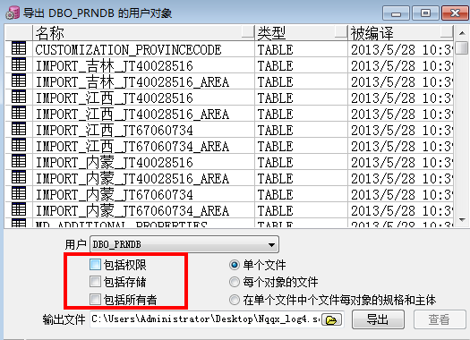
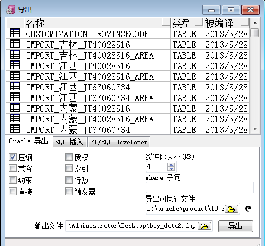
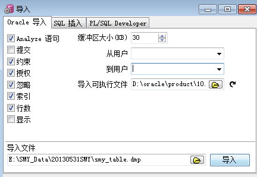

# Oracle数据库备份和恢复指南

## 目录

[[toc]]

## 概述

Oracle数据库的备份和恢复是数据库管理中的核心任务。本文档将详细介绍如何使用PL/SQL Developer工具进行Oracle数据库的完整备份和恢复操作，包括用户对象（存储过程、触发器、序列等）和表数据的备份恢复流程。

## 1. 备份操作

### 1.1 导出用户对象（存储过程、触发器、序列等）

#### 操作步骤

1. 在PL/SQL Developer中，选择菜单 **Tools(工具)** → **Export User Objects（导出用户对象）**

2. 在弹出的对话框中进行如下配置：

   

#### 重要配置说明

- **红色框住部分建议不选**：这样在执行SQL时，会根据当前登录账户来创建对象
- **对象选择**：在对象列表中使用 `Ctrl+A` 全选所有对象（如果只需导出部分对象，可单独选择）
- **输出设置**：设置输出文件地址和文件名
- **完成导出**：点击导出按钮完成操作

### 1.2 导出表数据

#### 操作步骤

1. 在PL/SQL Developer中，选择菜单 **Tools(工具)** → **导出表**

2. 在弹出的对话框中进行配置：

   

#### 导出格式选择

##### Oracle导出格式（DMP文件）

**适用场景：**
- 数据量较大的情况
- 表中包含CLOB或NCLOB字段

**配置要求：**
- 选择Oracle导出
- **勾选压缩选项**（节省存储空间）
- **必须勾选的选项**：约束、索引、行数、触发器
- 设置输出文件地址

**条件导出：**
如果只需导出部分数据，可在Where条件处添加限制条件，例如：
```sql
rownum <= 1000  -- 导出前1000条记录
```

##### SQL插入格式

**适用场景：**
- 数据量较小的情况
- 不包含CLOB、NCLOB字段的表

**特点：**
- 生成SQL格式文件
- 便于查看和编辑
- 文件体积相对较大

## 2. 恢复操作

### 2.1 恢复顺序重要说明

> **⚠️ 重要提醒**：恢复数据时，必须先恢复DMP格式的表数据文件，然后再恢复其他数据库对象。

### 2.2 表数据恢复

#### DMP文件恢复

1. 在PL/SQL Developer中，选择菜单 **Tools(工具)** → **导入表**

2. 在弹出的对话框中进行配置：

   

3. **关键配置**：
   - 在"到用户"处选择当前登录的账户
   - 选择要导入的DMP文件
   - 确认导入设置后开始恢复

#### SQL文件恢复

1. 在PL/SQL Developer中新建一个**命令窗口（Command Windows）**
2. 打开备份的SQL文件，复制所有内容
3. 在命令窗口中粘贴（`Ctrl+V`）SQL内容
4. 系统将自动开始执行恢复操作

### 2.3 恢复其他数据库对象

#### 操作步骤

1. **登录准备**：
   - 使用PL/SQL Developer登录目标Oracle数据库
   - 确保登录账户具有足够的权限
   - **注意**：恢复的对象将在当前登录账户下创建

2. **执行恢复**：
   - 打开先前备份的表结构SQL文件
   - 全选文件内容（`Ctrl+A`）
   - 在PL/SQL Developer中新建**命令窗口（Command Windows）**
   - 粘贴SQL内容（`Ctrl+V`）
   - 系统自动开始执行恢复操作

## 3. 备份恢复最佳实践

### 3.1 备份策略

#### 完整备份流程
```
1. 导出用户对象 → 生成SQL文件
2. 导出表数据 → 生成DMP文件或SQL文件
3. 验证备份文件完整性
4. 记录备份时间和版本信息
```

#### 备份文件命名建议
```
格式：项目名_备份类型_日期.扩展名
示例：
- MyProject_Objects_20241201.sql
- MyProject_Data_20241201.dmp
```

### 3.2 恢复策略

#### 恢复优先级
```
1. 首先恢复表结构和数据（DMP文件）
2. 然后恢复存储过程、触发器等对象
3. 最后验证数据完整性和功能正确性
```

#### 恢复前检查清单
- [ ] 确认目标数据库环境正确
- [ ] 验证登录账户权限
- [ ] 备份当前数据（如果存在）
- [ ] 确认备份文件完整性

### 3.3 注意事项和常见问题

#### CLOB/NCLOB字段处理
- **问题**：包含CLOB或NCLOB字段的表必须使用DMP格式
- **解决方案**：对于此类表，强制选择Oracle导出格式

#### 权限问题
- **问题**：恢复时可能遇到权限不足
- **解决方案**：确保登录用户具有CREATE权限

#### 对象依赖关系
- **问题**：某些对象可能存在依赖关系
- **解决方案**：按照表→视图→存储过程→触发器的顺序恢复

#### 字符集兼容性
- **问题**：不同环境间字符集可能不兼容
- **解决方案**：确保源和目标数据库字符集一致

## 4. 高级备份恢复技巧

### 4.1 增量备份策略

对于大型数据库，可以考虑：
- 定期全量备份用户对象
- 每日增量备份变更数据
- 使用时间戳条件进行增量导出

### 4.2 自动化脚本

可以编写批处理脚本实现：
- 定时自动备份
- 多环境同步
- 备份文件自动归档

### 4.3 性能优化

#### 大数据量导出优化
- 启用压缩选项
- 分批次导出大表
- 使用并行处理（如果数据库支持）

#### 网络传输优化
- 在数据库服务器本地进行备份操作
- 使用压缩传输备份文件
- 考虑使用专用网络进行数据传输

## 5. 故障排除指南

### 5.1 常见错误及解决方案

| 错误类型 | 可能原因 | 解决方案 |
|----------|----------|----------|
| 权限不足 | 用户权限不够 | 使用具有DBA权限的用户执行 |
| 对象已存在 | 目标库中已有同名对象 | 先删除现有对象或使用不同用户 |
| 字符集错误 | 源和目标字符集不匹配 | 统一字符集或进行字符集转换 |
| 空间不足 | 表空间空间不够 | 扩展表空间或清理无用数据 |

### 5.2 验证恢复结果

恢复完成后，应该进行以下验证：
- 检查对象数量是否正确
- 验证数据记录数是否一致
- 测试关键功能是否正常
- 检查约束和索引是否生效

## 总结

使用PL/SQL Developer进行Oracle数据库备份和恢复是一个相对简单但需要谨慎操作的过程。关键在于：

1. **正确的操作顺序**：先备份用户对象，再备份数据；恢复时先恢复数据，再恢复对象
2. **合适的格式选择**：根据数据特点选择DMP或SQL格式
3. **充分的测试验证**：恢复后进行完整性检查
4. **定期备份习惯**：建立规范的备份制度

遵循本文档的指导，可以确保Oracle数据库备份恢复操作的安全性和可靠性。