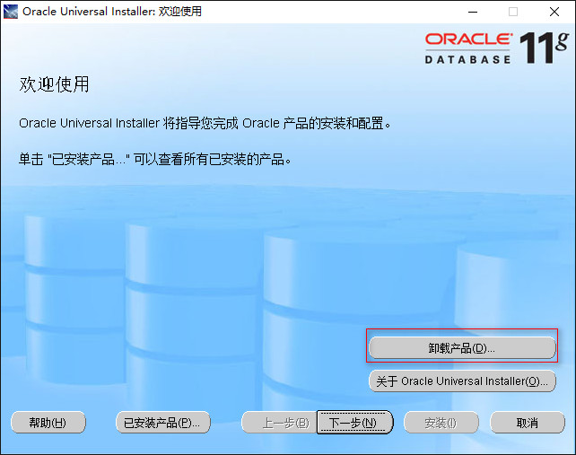
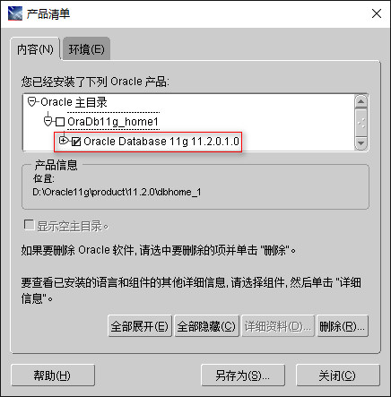
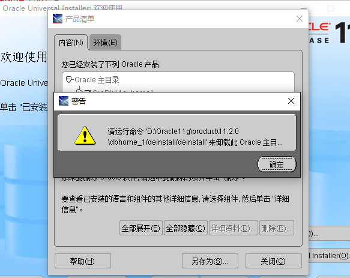
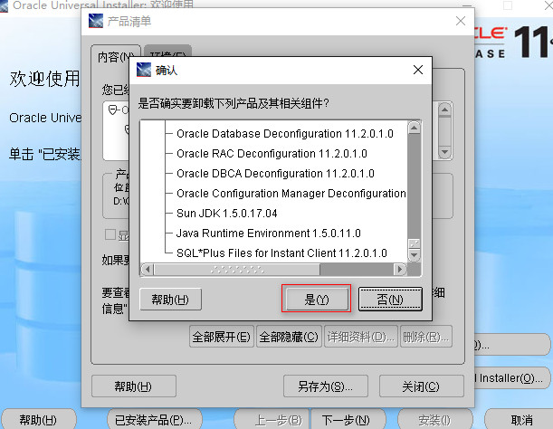

# Oracle 11g 卸载指南 (win 10)

## 目录

[[toc]]

## 概述

本文档提供了在 Windows 10 系统上完整卸载 Oracle 11g 数据库的详细步骤。完整的卸载过程包括停止服务、运行卸载程序、清理注册表和环境变量等步骤。

## 前提条件

- 已在 Windows 10 系统上安装 Oracle 11g
- 具有管理员权限
- 建议在卸载前备份重要数据

## 卸载步骤

### 第一步：停止 Oracle 服务

1. 按 `Win + R` 打开运行对话框
2. 输入 `services.msc` 并按回车，或通过以下路径访问：
   - **开始** → **设置** → **控制面板** → **管理工具** → **服务**
3. 在服务列表中找到所有以 "Oracle" 开头的服务
4. 右键点击每个 Oracle 服务，选择 **停止**

### 第二步：运行 Universal Installer

1. 找到并运行 Oracle Universal Installer
2. 启动卸载程序

### 第三步：选择卸载产品

在 Universal Installer 中选择 **卸载产品** 选项。

### 第四步：选择要卸载的组件

**重要提示**：只勾选 `Oracle Database 11g 11.2.0.1.0`

> ⚠️ **注意**：不要勾选 `OraDb11g_home1`，否则可能会出现错误：

### 第五步：确认卸载

当系统提示确认卸载时，选择 **是** 继续。

### 第六步：手动清理注册表和环境变量

卸载程序完成后，需要手动清理残留的注册表项和环境变量。

#### 清理注册表

1. 按 `Win + R` 打开运行对话框，输入 `regedit` 启动注册表编辑器

2. **删除以下注册表项**（如果存在）：

   - `HKEY_LOCAL_MACHINE\SOFTWARE\ORACLE` - 完整删除此项
   
   - `HKEY_LOCAL_MACHINE\SYSTEM\CurrentControlSet\Services` 
     - 删除所有以 `oracle` 或 `OraWeb` 开头的键
   
   - `HKEY_LOCAL_MACHINE\SYSTEM\CurrentControlSet\Services\Eventlog\Application`
     - 删除所有 Oracle 相关项
   
   - `HKEY_CLASSES_ROOT`
     - 删除所有以 `Ora`、`Oracle`、`Orcl` 或 `EnumOra` 为前缀的键
   
   - `HKEY_CURRENT_USER\Software\Microsoft\Windows\CurrentVersion\Explorer\MenuOrder\Start Menu\Programs`
     - 删除所有以 `oracle` 开头的键
   
   - `HKEY_LOCAL_MACHINE\SOFTWARE\ODBC\ODBCINST.INI`
     - 删除除 `Microsoft ODBC for Oracle` 以外的所有包含 Oracle 的键

#### 清理环境变量

1. 右键点击 **此电脑** → **属性** → **高级系统设置** → **环境变量**

2. 在系统变量中找到以下变量，删除其中与 Oracle 相关的路径：
   - `CLASSPATH`
   - `PATH`
   - `ORACLE_HOME`（如果存在，完全删除）
   - `TNS_ADMIN`（如果存在，完全删除）

### 第七步：重启系统

完成上述所有步骤后，重启计算机以确保所有更改生效。

### 第八步：验证卸载结果

系统重启后，验证 Oracle 是否完全卸载：

1. 打开服务管理器（`services.msc`）
2. 确认服务列表中没有任何 Oracle 相关服务
3. 检查程序和功能中是否还有 Oracle 相关程序
4. 确认环境变量中已清除 Oracle 相关设置

## 故障排除

### 常见问题

1. **服务无法停止**
   - 以管理员身份运行命令提示符
   - 使用 `net stop [服务名]` 强制停止服务

2. **注册表项删除失败**
   - 确保以管理员身份运行注册表编辑器
   - 检查是否有其他程序正在使用相关注册表项

3. **卸载程序找不到**
   - 尝试从 Oracle 安装目录中找到 `setup.exe`
   - 或从控制面板的程序和功能中卸载

## 注意事项

- 在执行卸载操作前，请确保备份重要的数据库数据
- 建议在系统空闲时进行卸载操作
- 如果系统中安装了多个 Oracle 版本，请谨慎操作，避免误删其他版本的组件
- 删除注册表项时要格外小心，建议先备份注册表

## 总结

按照以上步骤可以完整卸载 Oracle 11g，确保系统中不留任何残余文件和配置。完成卸载后，系统将完全清除 Oracle 11g 的所有痕迹。