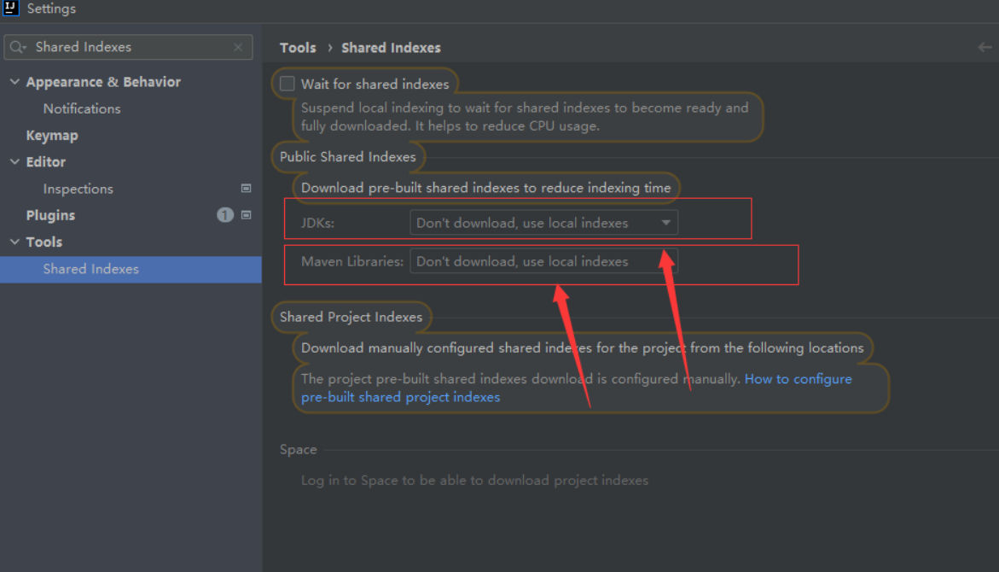
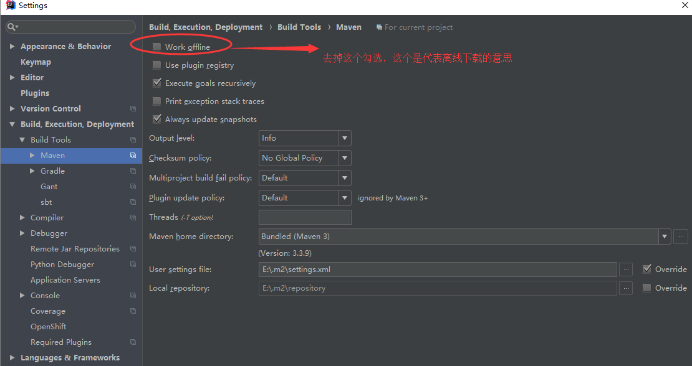
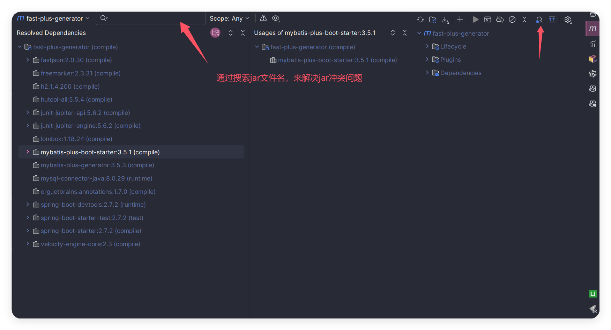
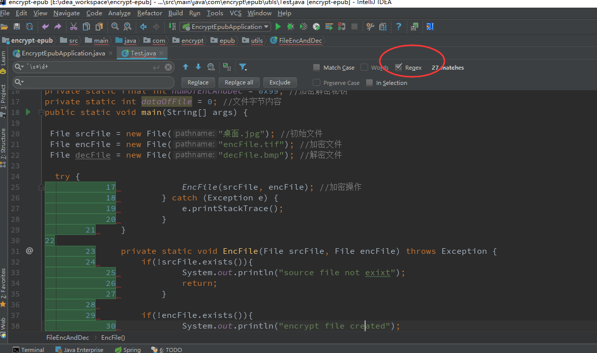
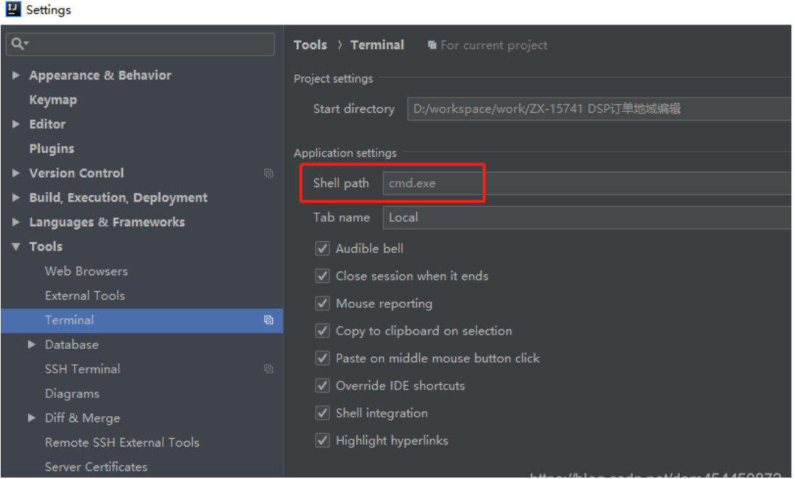
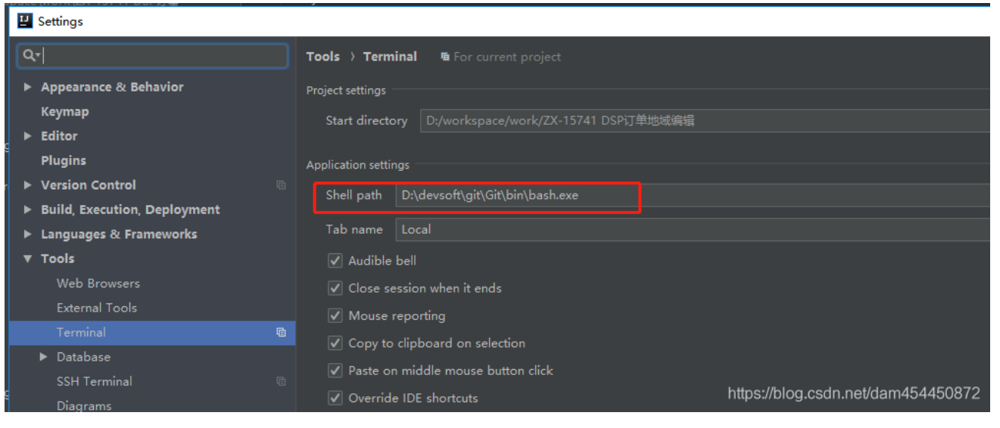
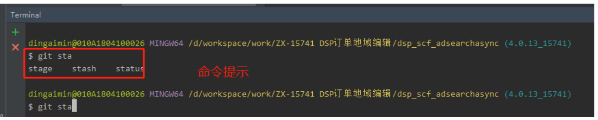
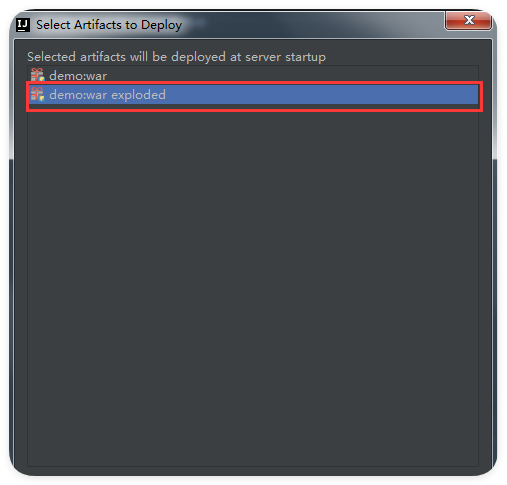
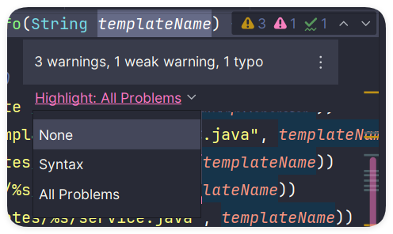

# IDEA 常见问题(一)

## 目录

[[toc]]

## 1. 性能优化问题

### CPU飙升和内存占用过高
- **问题描述**：IDEA运行时CPU使用率过高，内存占用过大
- **解决方案**：
  - 禁用不必要的自带插件，减少内存占用
  - 调整IDEA内存设置：Help → Change Memory Settings → 设置合适的内存大小 → Save and Restart

- 或者修改 `D:\SoftWare\IntelliJ IDEA 2023.3.2\bin\idea64.exe.vmoptions` 文件配置
  * -Xms128m
  * -Xmx2048m

### 修改文件或点击pom时卡顿
- **问题描述**：编辑文件或操作pom文件时出现明显卡顿
- **解决方案**：
  - 搜索 "Shared Indexes" 设置
  - 禁用相关的共享索引功能以提升性能



## 2. Maven相关问题

### Maven Reimport失效
- **问题场景**：
  - Spring Boot切换版本时，相应的Jar文件不自动更新
  - 点击reimport失效，点击刷新图标失效
- **解决方式**：
  - 检查Maven设置中的 "Work offline" 选项
  - 取消勾选 "Work offline"（离线下载会导致版本切换时无法更新Jar文件）



### Maven模块变成灰色
- **问题描述**：项目中的Maven模块在IDEA中显示为灰色
- **可能原因**：模块配置问题或Maven项目结构识别错误

### 使用Maven Helper插件解决jar包冲突
- **解决方案**：MavenHelper是一个用于分析和解决jar包冲突的插件，它提供了一个图形化的界面来查看pom.xml文件。在遇到如mysql-connector-java版本冲突时，可以通过MavenHelper找出冲突来源并进行调整。此外，它还支持查询特定jar（如neo4j-java-driver）是如何被引入项目的。




### IDEA强制更新Maven的包

1、手动删除Project Settings里面的Libraries内容，【Ctrl】+【Alt】+【Shift】+【S】，全选之后点击左上角的减号按钮。
2、在Maven Project的试图里的Lifecycle下面clean一下，删除之前编译过的文件；
3、项目右键->Maven->Reimport
4、如果还不能更新，那么直接删除本地仓库的全部包，然后重新下载一


## 3. 运行和部署问题

### Test运行报错：Command line is too long
- **错误信息**：Error running 'XXX': Command line is too long. Shorten command line
- **解决方案**：
  - 在项目的 `.idea/workspace.xml` 中开启动态路径
  - 在 `<component name="PropertiesComponent">` 中添加：
    ```xml
    <property name="dynamic.classpath" value="true" />
    ```

### Tomcat部署war和war exploded的区别
- **war exploded模式**：解压模式，支持热部署
- **使用场景**：需要 "Update classes and resources" 功能时必须使用exploded模式

### On 'Update' action下无Update classes and resources选项
- **解决方案**：在Tomcat设置的Deployment中使用exploded模式的war包

## 4. 编辑器显示问题

### 代码编辑器区域不显示
- **问题原因**：项目中有大文件载入（如大的字体文件ttf/otf），导致加载异常
- **解决方式**：重新导入相关文件即可恢复显示

### 删除复制代码所带的数字列表
- **解决方案**：使用正则表达式 `^\\s*\\d+` 在查找替换功能中删除行首数字



## 5. 版本控制问题

### SVN报错：No appropriate protocol
- **问题场景**：SVN协议从svn协议变更到https协议
- **解决方案**：
  - 进入 Preferences → Version Control → SubVersion
  - 启用 "Enable Interactive Mode"
  - 适用系统：macOS 10.14，IDEA版本2018.2.7

### 设置TortoiseSVN插件
- **问题**：Cannot run program svn
- **解决方案**：取消IDEA默认的SVN设置，配置使用TortoiseSVN

## 6. 终端和命令行问题

### Windows IDEA中terminal无法使用Linux命令
- **问题描述**：默认terminal是cmd.exe，无法使用ll、ls等Linux命令
- **解决方案**：
  1. 修改Shell path从cmd.exe改为bash.exe
  
  

  

  2. 重启IDEA使配置生效
  
  

  3. 但我最开始的不能使用ll命令，在user目录下创建如下两个文件, 在用户目录下创建 `.bash_profile` 和 `.bashrc` 文件：
     
     `.bash_profile`:
     ```bash
     if [ -f ~/.bashrc ]; then . ~/.bashrc; fi
     ```
     
     `.bashrc`:
     ```bash
     alias ls='ls -F --color=auto --show-control-chars'
     export LC_ALL=zh_CN.UTF-8
     alias ll='ls -la -F --color=auto --show-control-chars'
     ```
     然后重新启动idea，ll命令可以用了

## 7. intellij idea 中On 'Update' action 下无Update classes and resources选项

intellij idea 中使用tomcat发布项目时，On ‘Update’ action 下无Update classes and resources选项，这时在tomcat设置中Deployment要使用exploded模式的war包。只有exploded模式下才会有update classes and resources这项，如下图：



## 8. 其他实用功能

### 自定义注释模板
- **功能**：设置类注释和方法注释模板
- **作用**：提高代码规范性和开发效率

### 设置警告级别
- **功能**：调整IDEA的代码警告提示级别
- **目的**：减少过多的警告信息干扰



### 忽略不想提交的文件
- **功能**：配置版本控制忽略文件
- **应用场景**：避免将临时文件、配置文件等提交到版本库

---

> **提示**：以上问题解决方案基于不同版本的IDEA，具体操作界面可能略有差异，请根据实际版本进行调整。