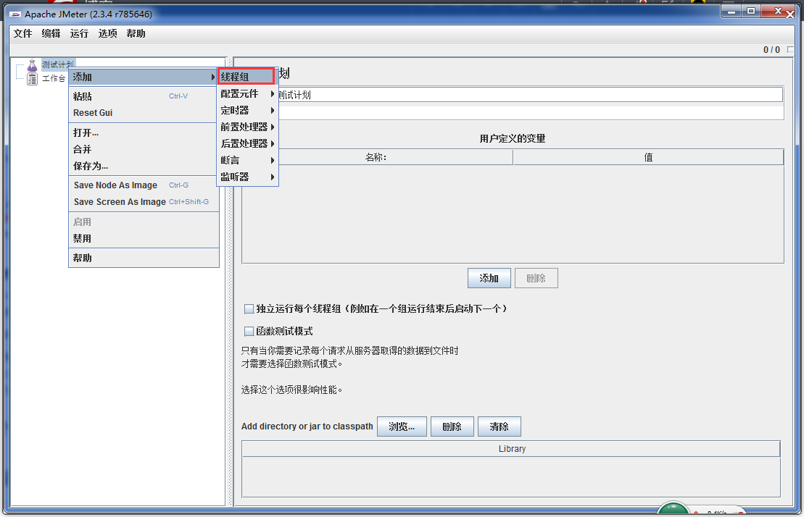
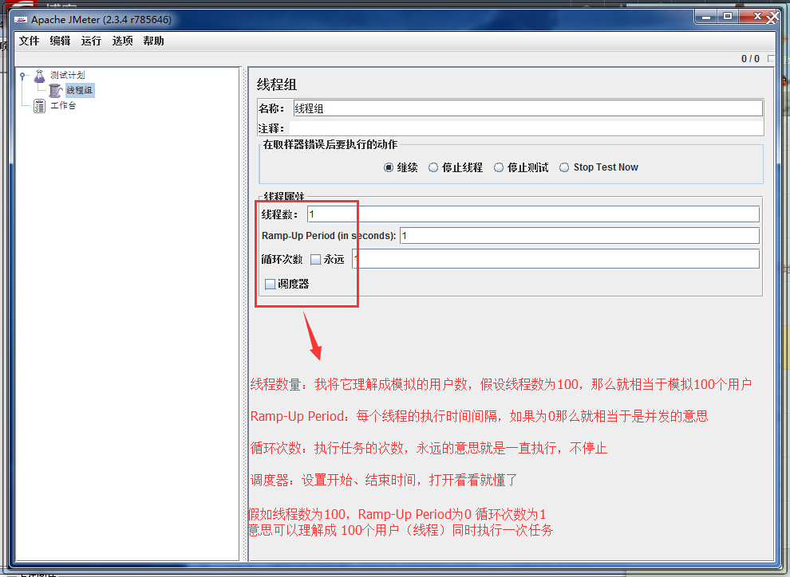
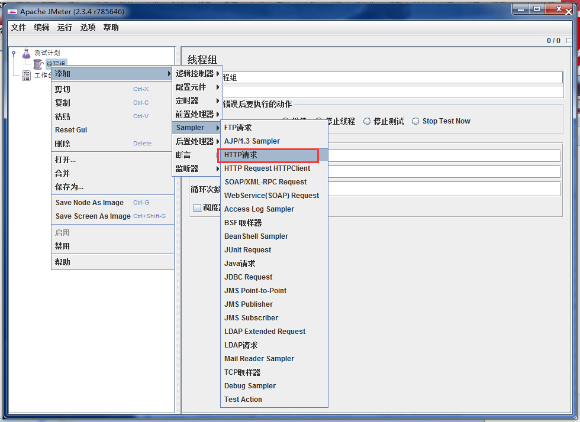
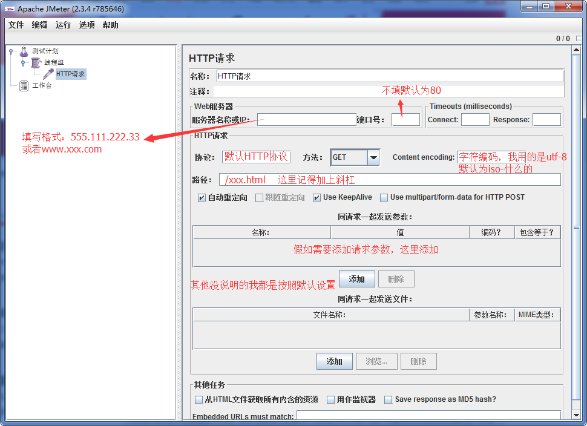
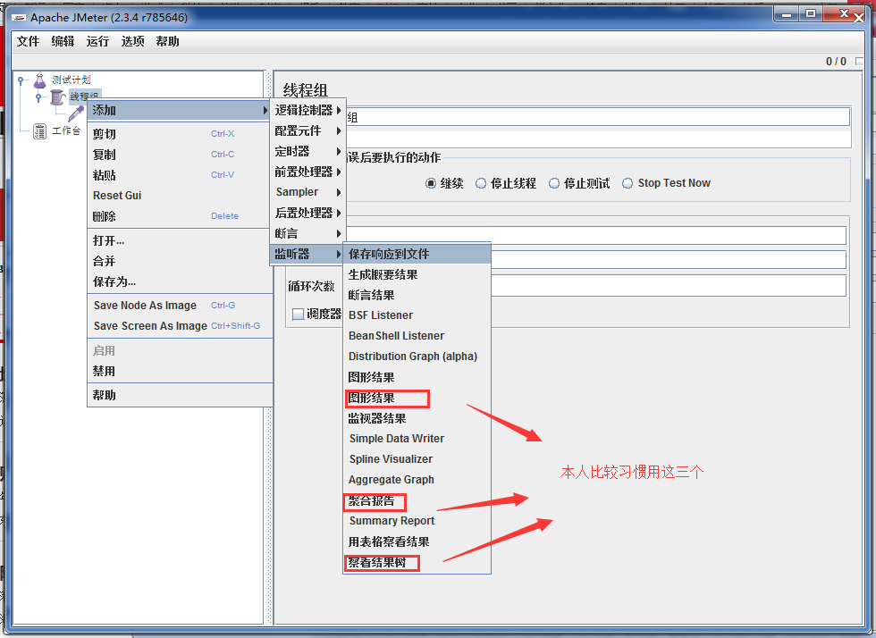
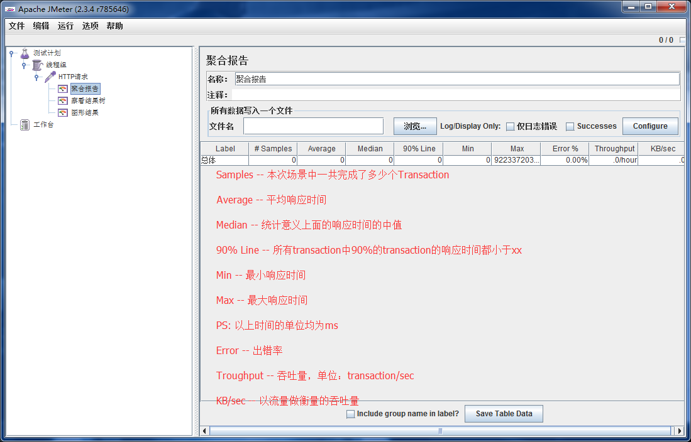
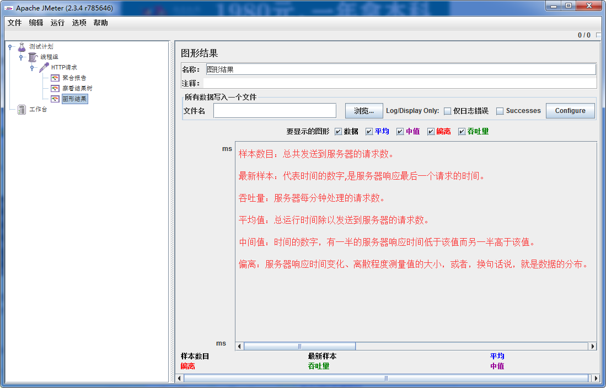

# JMeter HTTP 压力测试简单示例教程

## 目录

[[toc]]

## 案例背景

本教程基于一个真实的项目需求：为外网用户开发报名系统，需要测试服务器能同时承受多少条 HTTP 请求。

### 测试环境
- **服务器系统**: Windows 2003  
- **Web服务器**: Tomcat 7.0
- **JDK版本**: 7.0
- **CPU**: 8核 2.9GHz 双处理器
- **内存**: 16GB
- **应用场景**: 报名系统（提供报名和找回报名号接口）

## 准备工作

### 1. 下载和安装 JMeter

1. 前往 [Apache JMeter 官网](https://jmeter.apache.org/) 下载最新版本
2. 解压下载的文件（可能是 .tgz 或 .zip 格式）
3. 确保本机已安装 JDK 并配置好环境变量

### 2. 启动 JMeter

有两种启动方式：

**方式一（推荐）**:
- 进入解压后的 JMeter 文件夹
- 运行 `bin/jmeter.bat`（Windows）或 `bin/jmeter.sh`（Linux/Mac）

**方式二（备用）**:
- 如果 .bat 文件无法运行，直接双击运行 `bin/ApacheJMeter.jar`

> 💡 **故障排除**: 如果提示"创建不了JAVA虚拟机"，请检查 JDK 安装和环境变量配置

## 实战演示：HTTP 并发测试

### 步骤 1: 创建线程组

1. 启动 JMeter 后，在左侧测试计划树中
2. 右键点击 **"Test Plan"**
3. 选择 **Add** → **Threads (Users)** → **Thread Group**



### 步骤 2: 配置线程组参数

在线程组配置面板中设置以下参数：

| 参数名称 | 设置值 | 说明 |
|---------|--------|------|
| **Number of Threads (users)** | 100 | 模拟 100 个并发用户 |
| **Ramp-Up Period (in seconds)** | 60 | 在 60 秒内逐步启动所有用户 |
| **Loop Count** | 10 | 每个用户执行 10 次请求 |



> 📊 **测试策略**: 
> - 第一次测试：100 个用户，观察系统表现
> - 后续可逐步增加到 200、350 个用户进行压力测试

### 步骤 3: 创建 HTTP 请求

1. 右键点击刚创建的 **Thread Group**
2. 选择 **Add** → **Sampler** → **HTTP Request**



### 步骤 4: 配置 HTTP 请求参数

在 HTTP Request 配置面板中填入：

| 参数 | 示例值 | 说明 |
|------|--------|------|
| **Server Name or IP** | `192.168.1.100` | 目标服务器地址 |
| **Port Number** | `8080` | Tomcat 默认端口 |
| **HTTP Request** | `GET` 或 `POST` | 请求方法 |
| **Path** | `/register/submit` | 报名接口路径 |



**POST 请求示例参数**:
```
name=测试用户
phone=13800138000
email=test@example.com
```

### 步骤 5: 添加结果监听器



为了分析测试结果，需要添加监听器：

#### 5.1 添加聚合报告
1. 右键点击 **Thread Group**
2. 选择 **Add** → **Listener** → **Aggregate Report**

#### 5.2 添加图形结果
1. 右键点击 **Thread Group**
2. 选择 **Add** → **Listener** → **Graph Results**

#### 5.3 添加查看结果树（可选）
1. 右键点击 **Thread Group**  
2. 选择 **Add** → **Listener** → **View Results Tree**

## 执行测试

### 运行测试
1. 点击工具栏上的绿色 **启动** 按钮 ▶️
2. 观察右侧监听器中的实时结果
3. 测试完成后点击 **停止** 按钮 ⏹️

### 结果分析

#### 聚合报告关键指标



| 指标 | 含义 | 期望值 |
|------|------|--------|
| **Samples** | 请求总数 | - |
| **Average** | 平均响应时间 | < 1000ms |
| **90% Line** | 90% 请求的响应时间 | < 2000ms |
| **95% Line** | 95% 请求的响应时间 | < 3000ms |
| **99% Line** | 99% 请求的响应时间 | < 5000ms |
| **Throughput** | 吞吐量（请求/秒） | 越高越好 |
| **Error %** | 错误率 | 0% |

#### 图形结果分析



- **绿线**: 平均响应时间
- **红线**: 吞吐量
- **蓝线**: 偏差（Deviation）

## 实际测试结果分析

根据文档中的实际测试经验：

### 测试场景设置
- **数据库**: 包含 1000 条数据的查询操作
- **网络环境**: 测试机器和服务器在同一内网网段

### 测试结果总结

| 并发用户数 | 持续时间 | 响应时间偏差 | CPU使用率 | 结论 |
|-----------|----------|-------------|----------|------|
| 100 | 10分钟 | <100ms | ~20% | 性能良好 |
| 200 | 10分钟 | <100ms | ~20% | 性能稳定 |
| 350 | 10分钟 | ~100ms | ~25% | 接近性能瓶颈 |

### 性能瓶颈分析

**观察到的现象**:
- CPU 使用率最高不超过 25%
- 响应时间偏差随并发数增加而增长
- 系统瓶颈可能不在 CPU

**可能原因**:
1. **Tomcat 配置未优化** - 默认线程池设置较小
2. **数据库连接池限制** - 连接数不足以支持高并发
3. **网络I/O限制** - 网络带宽或连接数限制
4. **内存使用** - JVM堆内存设置或GC频率

### 推荐的并发承载量
根据测试结果，该系统的**安全并发量约为 350-400 用户**。

## 优化建议

### 1. Tomcat 调优
```xml
<!-- server.xml 配置示例 -->
<Connector port="8080" protocol="HTTP/1.1"
           maxThreads="300"
           minSpareThreads="20"
           maxSpareThreads="50"
           connectionTimeout="20000" />
```

### 2. JVM 参数优化
```bash
# 在 catalina.sh 或 catalina.bat 中添加
JAVA_OPTS="-Xms2g -Xmx4g -XX:+UseG1GC"
```

### 3. 数据库连接池优化
```properties
# 数据库连接池配置
initial-size=20
max-active=100
max-idle=50
min-idle=10
```

## 扩展测试场景

### 场景1: 梯度压力测试
```
阶段1: 50用户  → 运行5分钟
阶段2: 100用户 → 运行5分钟  
阶段3: 200用户 → 运行5分钟
阶段4: 400用户 → 运行5分钟
```

### 场景2: 长时间稳定性测试
```
配置: 200用户持续运行2小时
目标: 验证系统长期稳定性
```

### 场景3: 峰值测试
```
配置: 快速增加到500用户
目标: 找到系统崩溃点
```

## 最佳实践提示

### ✅ 推荐做法
- 在与服务器相同网段进行测试，减少网络影响
- 逐步增加并发数，观察性能拐点
- 同时监控服务器 CPU、内存、网络等资源
- 使用多种监听器对比分析结果
- 多次运行测试确保结果的一致性

### ❌ 避免事项
- 不要在生产环境进行压力测试
- 不要忽视错误率，即使响应时间正常
- 不要只看单一指标，要综合分析
- 测试时间不宜过短，至少10分钟以上

## 总结

通过 JMeter 进行 HTTP 压力测试是一个相对简单但非常实用的性能测试方法。本案例展示了如何：

1. **快速上手** - 从零开始创建完整的测试计划
2. **实际应用** - 基于真实业务场景进行测试
3. **结果分析** - 理解关键性能指标含义
4. **问题诊断** - 识别性能瓶颈和优化方向

记住，性能测试不是一次性活动，而是一个持续的过程。随着业务增长和系统变化，需要定期重新评估系统性能表现。

---

**参考资料**:
- [Apache JMeter 官方文档](https://jmeter.apache.org/usermanual/)
- [JMeter 最佳实践指南](https://jmeter.apache.org/usermanual/best-practices.html)